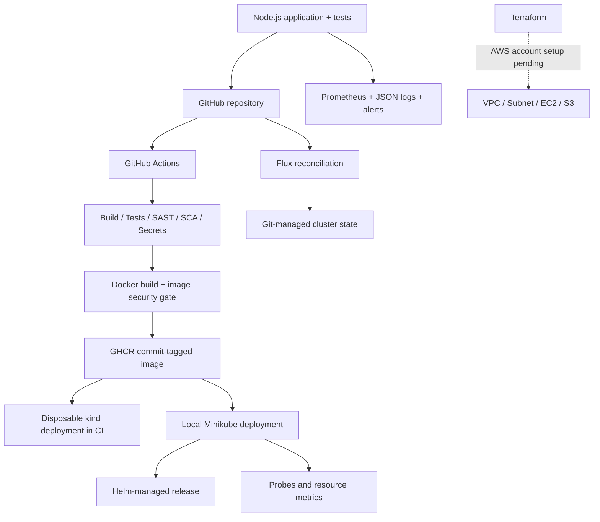
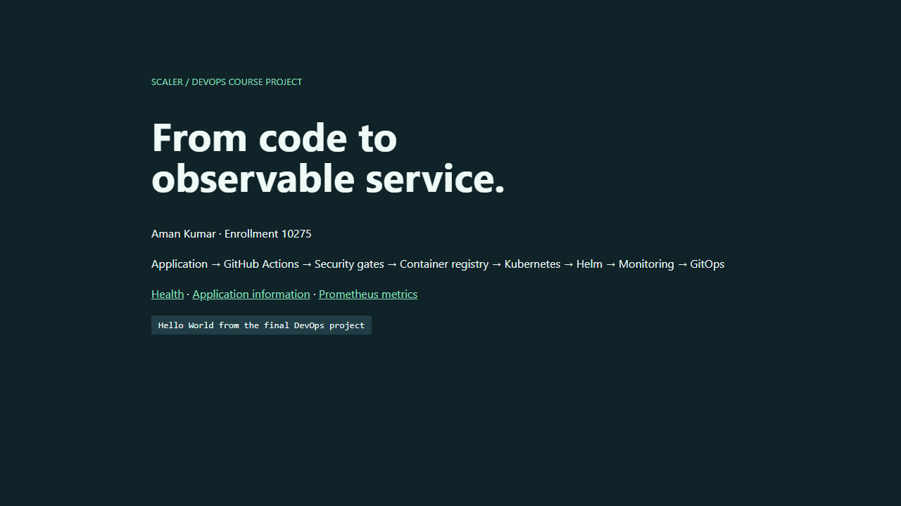

# Session 21 — Final DevOps project

**Aman Kumar · Enrollment 10275**

A complete local DevOps demonstration centered on a small HTTP application: source control, tests, security gates, Docker, image publishing, Kubernetes, Helm, monitoring, GitOps and failure recovery. The AWS infrastructure is prepared and locally tested; its live deployment is **pending AWS setup**, as requested.

## Architecture



The diagram separates demonstrated local/CI delivery from the pending cloud infrastructure. Helm and raw manifests are deployed in separate namespaces to avoid two controllers managing the same release. The local monitoring stack uses a separate instance of the same application image.

## Technology and source map

| Area | Files and evidence |
|---|---|
| Application | [Node.js server and five HTTP tests](application) |
| Docker | [Multi-stage Dockerfile](docker/Dockerfile) |
| Kubernetes | [Deployment, Service, ConfigMap, Secret template, Ingress, HPA and probes](kubernetes) |
| Helm | [Chart and lifecycle evidence](helm/README.md) |
| Terraform | [Infrastructure and local validation](terraform/README.md) |
| CI/CD | [Active root workflow](../.github/workflows/devsecops.yml), [execution evidence](../session-16-cicd/evidence/README.md) |
| Security | [Tools, configuration and gates](security/README.md) |
| Monitoring | [Prometheus, alerts and actual outage/recovery](monitoring/README.md) |
| GitOps | [Flux reconciliation and drift correction](gitops/README.md) |
| Troubleshooting | [Intentional failures, diagnosis, fixes and proof](troubleshooting/README.md) |

## Application and Docker setup

```sh
cd final-devops-project/application
npm ci --ignore-scripts
npm run build
npm test
npm start
# GET /, /healthz, /readyz, /api/info, /metrics
```

From `final-devops-project/`:

```sh
docker build -f docker/Dockerfile -t devops-final:local .
docker run --rm -p 127.0.0.1:8200:8080 devops-final:local
```

The Docker build runs the test suite. The runtime contains the Node executable and server, runs as an unprivileged user and excludes unused npm/Yarn package managers. The HTTP API never exposes its runtime token. Requests get a unique correlation ID, and logs omit query strings and request bodies.



## Kubernetes deployment

For an initial setup with Minikube on PATH, execute `kubernetes/deploy-local.ps1` (or pass `-Minikube <binary-path>`). It loads the image, creates a random runtime Secret, applies the manifests, switches to the local image and waits for rollout. The Secret value is never saved to Git. Once Flux owns the namespace, suspend its `final-application` Kustomization before manual image experiments and resume it afterward; otherwise the controller restores the Git version.

```sh
kubectl --context devops-homework -n devops-final get pods,svc,ingress,hpa
kubectl --context devops-homework -n devops-final top pods
kubectl --context devops-homework -n devops-final port-forward svc/devops-app 8201:80
curl http://localhost:8201/api/info
```

The [actual state output](kubernetes/evidence/state.txt) records the deployed service and HTTP response. Ingress requires a running ingress controller and the host header `devops.local`. HPA requires Metrics Server. Startup, readiness and liveness probes serve distinct purposes: allow initial startup, control traffic eligibility, and restart an unhealthy container. This app is stateless; `/tmp` uses `emptyDir`. Persistent storage is demonstrated separately in [Session 13](../session-13-storage-hpa/README.md).

## Helm

The [Helm chart](helm/README.md) packages the same app with configurable image, version, replicas, probes, ingress and HPA. Its recorded exercise installs a release, runs a Service health test, upgrades the application configuration and rolls it back. It uses `devops-final-helm`, separate from the raw-manifest namespace.

## Terraform and AWS

The [Terraform root](terraform/README.md) reuses the Session 19 module for a VPC, subnet, Internet Gateway/routing, security group, EC2 host, IAM instance role and private S3 bucket. Formatting, initialization, validation and mock-provider tests have executed. **No AWS resources have been provisioned yet.** Mock tests check configuration behavior, not AWS permissions, quotas, AMI availability or real resource creation.

Follow [AWS setup](../session-18-terraform/AWS-SETUP.md), then run plan/apply/inspect/destroy and add genuine cloud screenshots. The prepared EC2 host is not claimed to be a completed cloud Kubernetes cluster.

## CI/CD and DevSecOps

The workflow validates source, builds a tested image, rejects security findings, pushes to GHCR, deploys the commit-tagged artifact into kind, then checks health/API/metrics. Reports are uploaded on success or failure. See [Session 16](../session-16-cicd/README.md) for CI/CD concepts and [Session 17](../session-17-devsecops/README.md) for gates and the real image-vulnerability correction.

## Monitoring and GitOps

Prometheus scrapes the application, evaluates availability and memory rules, and demonstrated an alert firing during an intentional outage and clearing on recovery. JSON logs and request correlation IDs support diagnosis. Distributed tracing is explained but no multi-service trace backend is claimed.

Flux pulls this repository and continuously reconciles its desired state. The dedicated ConfigMap drift test demonstrated automatic restoration without manually reapplying it. The final application was then handed to Flux: two Ready Pods run the pinned, scanned GHCR image and the Service returns HTTP 200. [Handoff evidence](gitops/evidence/final-app-handoff.txt) records the Git revision, image digest and responses. HPA manages replica count instead of GitOps continually resetting it.

## Troubleshooting and lessons learned

[The final challenge](troubleshooting/README.md) intentionally breaks application delivery and networking, records investigation with cluster events/endpoints, then restores healthy behavior. The independent [Session 14 labs](../session-14-troubleshooting/README.md) cover further common failure modes.

- Check image contents as well as application dependencies: a minimal app can inherit vulnerable unused tools.
- A healthy Pod does not guarantee a working Service; selectors and endpoints must agree.
- A runtime Secret and a Git-managed manifest have different lifecycles; preserve that separation.
- Rollout completion and endpoint updates are asynchronous; wait for observable conditions.
- Prove failures and recovery with logs and HTTP responses, and label mocked/cloud-pending work explicitly.

## Cleanup

Use each session's cleanup instructions. Remove only the lab's namespaces/releases/Compose projects after retaining evidence. Do not delete a shared Kubernetes context or unrelated Docker containers. Cloud cleanup remains part of the future Terraform execution; resources must be destroyed from the same state that created them.
