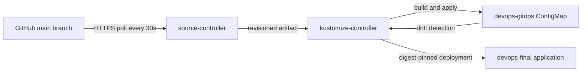

# GitOps with Flux

This demo uses the public [devops-homework repository](https://github.com/ReaperXD67/devops-homework) as the desired-state source for the `devops-homework` Minikube cluster. Two Flux controllers reconcile a ConfigMap in the isolated `devops-gitops` namespace and the complete final application in `devops-final`. Both reconciliations were verified Ready with real Git revisions and HTTP responses.

## Architecture



`source-controller` fetches the Git revision and produces an artifact. `kustomize-controller` builds the desired directory and reapplies it periodically. The controller runs inside Kubernetes: no developer terminal needs to keep executing `kubectl apply`. The reconciliation interval also corrects live changes that differ from Git. [Flux getting started](https://fluxcd.io/flux/get-started/), [Flux Kustomizations](https://fluxcd.io/flux/components/kustomize/kustomizations/).

## Files

| File | Purpose |
|---|---|
| [source.yaml](source.yaml) | Public GitRepository tracking `main`; no authentication Secret needed |
| [reconcile.yaml](reconcile.yaml) | Reconciles `final-devops-project/gitops/desired` every 30 seconds |
| [desired/](desired/) | Namespace and ConfigMap, with the message `Git is the source of truth` |
| [install.ps1](install.ps1) | Installs pinned Flux v2.9.6 with source and kustomize controllers only |
| [verify-drift.ps1](verify-drift.ps1) | Changes a live value and waits for automatic restoration |
| [final-app.yaml](final-app.yaml) | Active reconciliation of the final application's Kubernetes manifests every minute |

## Setup and reproduce

Prerequisites: the named local cluster, `kubectl`, Flux CLI v2.9.6, network access to GitHub/GHCR, and the desired directory already committed and pushed.

```powershell
./final-devops-project/gitops/install.ps1 -Context devops-homework -Flux flux
flux get sources git --context devops-homework
flux get kustomizations --context devops-homework
./final-devops-project/gitops/verify-drift.ps1 -Context devops-homework -Flux flux
```

The CLI release ZIP was downloaded from the official Flux GitHub release and checked against its published SHA-256 checksum. Flux installation runs with the permissions required to create its CRDs and controllers. Only `source-controller` and `kustomize-controller` are installed for this focused lab. [Optional components](https://fluxcd.io/flux/installation/configuration/optional-components/).

## Desired state, drift and delivery

- **Git as source of truth:** desired configuration is versioned and reviewed in commits. The cluster should converge to the selected revision.
- **Declarative configuration:** YAML describes the desired objects; controllers determine the actions needed to reach that state.
- **Continuous reconciliation:** Flux pulls changes and corrects differences over time. A manual live edit is temporary unless committed to Git or reconciliation is suspended.
- **CI versus GitOps CD:** CI tests/scans/builds an image; promotion changes a deployment image tag or digest in Git. Flux performs the deployment from that reviewed change.
- **Rollback:** revert the bad configuration commit, then let Flux reconcile. Changing only the live Deployment would be overwritten by Git.
- **Pruning:** `prune: true` removes managed objects deleted from Git. Review deletions carefully; the lab's namespace is intentionally isolated.

## Final application handoff: completed

After the troubleshooting drills restored the healthy application, the published container image was verified accessible and its scanned digest was committed to Git. Flux fetched commit [`f49214eecd0d301c73376d5736e008c7ac8b0fed`](https://github.com/ReaperXD67/devops-homework/commit/f49214eecd0d301c73376d5736e008c7ac8b0fed), applied the complete Kubernetes directory and became Ready. The [handoff transcript](evidence/final-app-handoff.txt) records the Deployment, Service, ConfigMap, Ingress, HPA and namespace being reconciled, followed by HTTP 200 from `/healthz` and `/api/info` through Service DNS.

The observed image was `ghcr.io/reaperxd67/devops-homework@sha256:bddd87c63b22371d1724581bd475ae584f774199dd828f92eaf87201d115e041`, with two Ready Pods. HPA existed but its metrics were still `<unknown>` in this immediate post-rollout snapshot; application readiness is not a claim that this handoff test demonstrated autoscaling.

To reproduce in a fresh lab, install Flux, ensure the public image can be pulled, and create `app-secret` in `devops-final` using the application setup before applying the active reconciliation. The runtime Secret is externally supplied and is not among the Git-managed resources. Keep real Secret values out of Git. For production use an external secret manager or encrypted manifests, least-privilege reconciliation identities, reviewed changes and immutable image digests.

```powershell
kubectl --context devops-homework apply -f final-devops-project/gitops/final-app.yaml
flux reconcile kustomization final-application --with-source --context devops-homework
flux get kustomizations --context devops-homework
kubectl --context devops-homework -n devops-final get deployment,service,ingress,hpa
```

Flux now owns desired application state. Subsequent local image patches or manual changes can be reverted at the next reconciliation. Update the image digest in Git for normal delivery. For an intentional troubleshooting drill, suspend `final-application`, perform and restore the experiment, then resume and reconcile it; [the drill README](../troubleshooting/README.md) gives that sequence. The controller installation and reconciliation resources are installed explicitly by these setup commands; this lab does not claim a fully self-bootstrapping cluster.

## Troubleshooting

| Symptom | Investigation and fix |
|---|---|
| GitRepository not Ready | `flux get sources git`; inspect source-controller logs for URL, network, branch or authorization failure |
| Desired path missing | Ensure the directory exists in the reported remote commit, not merely in an unpushed working tree |
| Kustomization build failed | `kubectl kustomize final-devops-project/gitops/desired`; inspect resource API versions and file paths |
| Apply denied | Inspect RBAC and the service account used for reconciliation |
| Manual change persists | Check `suspend`, controller readiness, interval and recent reconciliation errors |
| Application stuck | Inspect Deployment events, image accessibility, Secret/ConfigMap names, probes and resource requests |

```powershell
kubectl --context devops-homework -n flux-system get pods
kubectl --context devops-homework -n flux-system describe gitrepository devops-homework
kubectl --context devops-homework -n flux-system describe kustomization homework-demo
kubectl --context devops-homework -n flux-system logs deployment/source-controller --tail=30
kubectl --context devops-homework -n flux-system logs deployment/kustomize-controller --tail=30
```

## Evidence

Executed on **8 October 2026** against Kubernetes v1.34.0. Both controllers became Ready. [Initial synchronization](evidence/initial-sync.txt) fetched and applied public Git commit [`fc117d495fbe37568d8a72f06838d61e8946af1a`](https://github.com/ReaperXD67/devops-homework/commit/fc117d495fbe37568d8a72f06838d61e8946af1a).

[Installation output](evidence/installation.txt) and [drift verification output](evidence/drift.txt) contain captured commands, real Git revisions, live values and controller logs. The drift script waited for normal periodic reconciliation rather than manually applying the desired value. Selected lines from the run:

```text
MANUAL DRIFT - should be reverted by Flux
Waiting for automatic reconciliation; no kubectl apply or manual flux reconcile is run.
2026-10-08T15:32:36.8629536Z observed message: MANUAL DRIFT - should be reverted by Flux
2026-10-08T15:32:41.9749741Z observed message: MANUAL DRIFT - should be reverted by Flux
2026-10-08T15:32:47.0689130Z observed message: MANUAL DRIFT - should be reverted by Flux
2026-10-08T15:32:52.1696844Z observed message: Git is the source of truth
PASS: Flux automatically corrected manual drift to the value in Git.
```

The controller log at `15:32:47.313Z` records the ConfigMap as `configured` using the same Git revision, proving that the controller performed the correction. The brief initial `Source artifact not found` message occurred while the Git source was first being fetched; the subsequent Ready status and successful apply show recovery.
