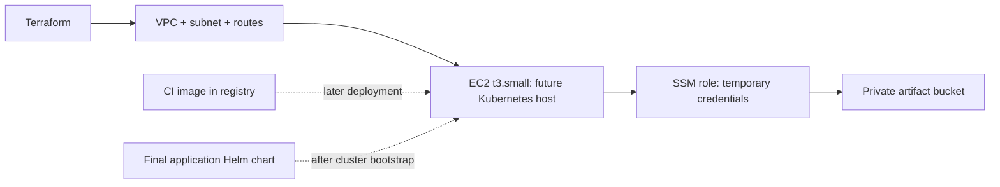

# Final project — Terraform infrastructure

**Aman Kumar · Enrollment 10275**

This root reuses the tested [Session 19 infrastructure module](../../session-19-cloud/modules/infrastructure/main.tf). It provisions a separate VPC, public subnet, routes, restricted HTTP security group, `t3.small` EC2 host, encrypted EBS, SSM instance role and private versioned S3 bucket under the `aman-scaler-final` prefix.

**Status:** Terraform source, initialization, formatting, validation and mocked tests are complete. [Actual local evidence](evidence/validation.txt). Live AWS provisioning is pending account setup. The instance boots an Nginx diagnostic page; it does not yet install Kubernetes or run the final application. The repository's local Kubernetes/Helm exercise and this future cloud deployment are distinct environments.

## How this connects to the final project



The application chart/manifests can be deployed to a cloud Kubernetes cluster after a deliberate cluster setup. The current Terraform module supplies the baseline host and storage, not EKS or a preconfigured Kubernetes control plane. Keeping the Kubernetes API closed is intentional.

## Checks and deployment

From the repository root:

```powershell
terraform -chdir=final-devops-project/terraform init
terraform -chdir=final-devops-project/terraform fmt -check -recursive
terraform -chdir=final-devops-project/terraform validate
terraform -chdir=final-devops-project/terraform test
```

For cloud execution, first complete [AWS-SETUP.md](../../session-18-terraform/AWS-SETUP.md), then create an ignored `local.auto.tfvars` in this folder with your real `allowed_http_cidr` IPv4 `/32`.

```powershell
cd final-devops-project/terraform
$env:AWS_PROFILE = 'scaler-lab'
aws sso login --profile scaler-lab
terraform plan -out=lab.tfplan
terraform show lab.tfplan
terraform apply lab.tfplan
terraform output
$instanceId = terraform output -raw instance_id
aws ssm start-session --target $instanceId
# Later, after verification and saving evidence:
terraform destroy
terraform state list
```

Review the [Session 19 runbook](../../session-19-cloud/README.md) for resource verification, troubleshooting and teardown. Do not apply both roots to the same state or assume that destroying one root removes the other's resources. State/plan files and credentials must remain out of the public repository.

Before declaring the cloud final project complete, capture a genuine apply, bootstrap and verify Kubernetes, deploy the final image/chart, check probes/HPA/Ingress/monitoring, record live results and then perform cleanup. None of those cloud results are claimed by the mock test transcript.
