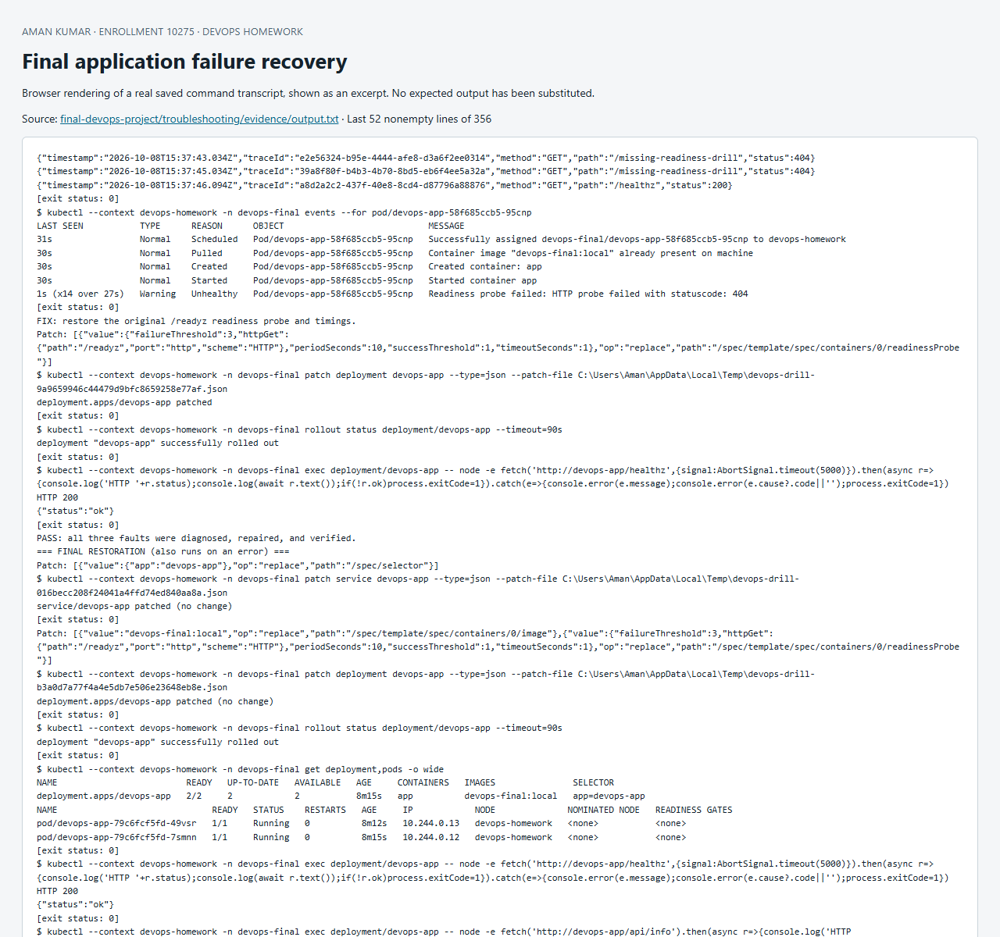

# Final troubleshooting challenge

**Aman Kumar · Enrollment 10275 · Executed 8 October 2026**

Three faults were deliberately introduced into the real final application in the local `devops-homework` Minikube cluster, namespace `devops-final`. Each was diagnosed from native Kubernetes output, repaired, and followed by a successful HTTP request through the Service. The final state was two Ready replicas with the original image, selector and readiness probe restored.

## Reproduce

Prerequisite: deploy the final app with [the local deployment script](../kubernetes/deploy-local.ps1). Run the drills only against this disposable course environment because the Service-selector drill intentionally interrupts access to its Service.

```powershell
./final-devops-project/troubleshooting/run-drills.ps1 -Context devops-homework -Namespace devops-final
```

The captured run occurred before the application was handed to Flux. The [subsequent GitOps handoff](../gitops/evidence/final-app-handoff.txt) replaced the local image with the public image pinned by digest and again verified two Ready replicas and HTTP 200. For a rerun while Flux owns the application, pause its reconciliation during fault injection so that it does not repair the fault before diagnostics capture it:

```powershell
flux suspend kustomization final-application --context devops-homework
try {
  ./final-devops-project/troubleshooting/run-drills.ps1 -Context devops-homework -Namespace devops-final
} finally {
  flux resume kustomization final-application --context devops-homework
  flux reconcile kustomization final-application --with-source --context devops-homework
}
```

The script reads and retains the original image, Service selector and readiness probe, then changes one fault at a time. Its `finally` block restores all three fields even if a diagnostic step fails. Source manifests, Secret contents and other namespaces are not changed. The transcript records command exit statuses; expected rollout/network failures are explicitly permitted while unexpected failures stop the exercise.

## Before → investigate → repair → verify

| Fault | Observed failure | Root cause | Repair and observed result |
|---|---|---|---|
| Nonexistent image tag | New Pod `0/1 ErrImagePull`; events also show `ImagePullBackOff`; rollout timed out | Registry returned `not found` for `ghcr.io/reaperxd67/devops-homework:nonexistent-troubleshooting-drill` | Restore `devops-final:local`; rollout completes and Service `/healthz` returns HTTP 200 |
| Wrong Service selector | Pods remain Ready, but EndpointSlice has `endpoints: null`; request gets `ECONNREFUSED` | `app=intentionally-unmatched-drill` selects no Pods, whose label is `app=devops-app` | Restore `app=devops-app`; EndpointSlice lists two Pod addresses and Service HTTP returns 200 |
| Wrong readiness path | New Pod is Running but `0/1`; kubelet reports HTTP 404 and application logs show the missing path | Probe requests `/missing-readiness-drill`, which does not exist | Restore `/readyz` and original probe timings; rollout completes and Service HTTP returns 200 |

### Image investigation

```powershell
kubectl --context devops-homework -n devops-final rollout status deployment/devops-app --timeout=35s
kubectl --context devops-homework -n devops-final get pods -o wide
kubectl --context devops-homework -n devops-final describe pod <new-pod>
kubectl --context devops-homework -n devops-final events --for pod/<new-pod>
```

The new Pod could not start because the requested image did not exist. `ErrImagePull` describes a failed pull attempt; `ImagePullBackOff` describes the increasing retry delay. Both appear in the same Pod's event history. The two old healthy replicas continued serving while the rolling update stalled: the strategy allows one extra Pod and requires zero unavailable replicas. The timeout is a deliberate diagnostic observation, not a completed rollout.

### Service investigation

```powershell
kubectl --context devops-homework -n devops-final describe service devops-app
kubectl --context devops-homework -n devops-final get pods --show-labels
kubectl --context devops-homework -n devops-final get endpointslices -l kubernetes.io/service-name=devops-app -o yaml
```

The Service's cluster IP still existed and the application Pods were healthy. However, there were no selected endpoints, which explains why requesting `http://devops-app/healthz` failed. Restoring the selector repopulated the EndpointSlice with `10.244.0.12` and `10.244.0.13` on port 8080 in this run. No application restart was required to repair the selector.

### Readiness investigation

```powershell
kubectl --context devops-homework -n devops-final describe pod <new-pod>
kubectl --context devops-homework -n devops-final logs <new-pod> --tail=15
kubectl --context devops-homework -n devops-final events --for pod/<new-pod>
```

The process was running and `/healthz` requests returned 200 in its logs, while the configured readiness URL returned 404. A Running phase therefore did not imply readiness for traffic. Readiness failure prevented the new Pod from becoming a ready Service endpoint, while the old replicas preserved availability. A liveness change or an application restart would not repair the incorrect URL; restoring the probe path did.

## Actual evidence and final state

The [full command/output transcript](evidence/output.txt) includes the initial healthy state, each failure, describe output, events, application logs, endpoint inspection, repairs, and final verification. Only Secret references appear in `kubectl describe`; no Secret values were read or printed.

Selected actual results:

```text
PASS: all three faults were diagnosed, repaired, and verified.
deployment "devops-app" successfully rolled out
deployment.apps/devops-app   2/2     2            2
HTTP 200
{"status":"ok"}
```

The final transcript also includes an HTTP 200 response from `/api/info`, proving that the application API works through Service DNS after recovery. Pod IPs, timestamps and generated Pod names are observations from this execution and will differ on another run.

## Lessons

- Inspect the actual image-pull error before changing permissions or networking; `not found` identifies a missing reference.
- A Service can exist without endpoints. Compare selectors against Pod labels before blaming DNS.
- Process state, liveness and readiness are separate signals; inspect the exact failed probe.
- Rollouts and EndpointSlice updates are asynchronous, so wait for observed recovery and repeat the failed request.
- Keep fault injection scoped, preserve the original configuration and verify cleanup even when an intermediate command fails.

References: [debug Pods](https://kubernetes.io/docs/tasks/debug/debug-application/debug-pods/), [debug Services](https://kubernetes.io/docs/tasks/debug/debug-application/debug-service/), [configure probes](https://kubernetes.io/docs/tasks/configure-pod-container/configure-liveness-readiness-startup-probes/).



