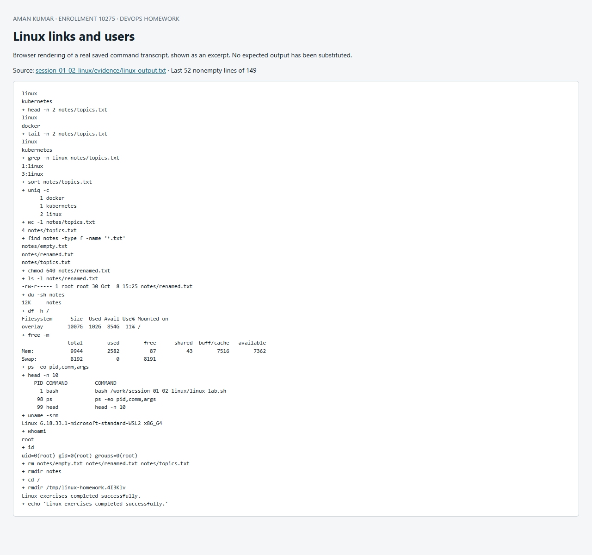

# Sessions 1–2: Linux fundamentals

**Student:** Aman · **Executed:** 8 October 2026

The exercises run in a disposable Ubuntu 24.04 container. File creation, link deletion and the test account are isolated from the host. The system journal exercise also runs against the existing Ubuntu WSL installation so that real service logs are available.

## Reproduce

From the repository root in Bash:

```bash
docker build -t devops-homework-foundations:local session-01-02-linux
docker run --rm --hostname linux-lab -v "$PWD:/work:ro" \
  devops-homework-foundations:local bash /work/session-01-02-linux/linux-lab.sh
```

On a systemd host:

```bash
journalctl --no-pager -n 20
journalctl -u cron.service --no-pager -n 20
journalctl -b --priority=warning --no-pager
journalctl --since '1 hour ago' --no-pager
journalctl -u cron.service -f  # follow until Ctrl+C
```

## Soft link versus hard link

| Property | Hard link (`ln file hard`) | Soft link (`ln -s file soft`) |
|---|---|---|
| Representation | Another directory entry for the same inode | A separate inode containing a target path |
| Removing the original filename | Content remains through the other hard link | The symbolic link becomes dangling |
| Crossing filesystems | Not supported | Supported |
| Directories | Normally disallowed | Supported |
| Link count | Increases the original inode's link count | Does not increase the target's hard-link count |

The transcript shows identical inode numbers for `original.txt` and `hard.txt`, with a link count of two. After `rm original.txt`, `cat hard.txt` still succeeds and `cat soft.txt` fails. Removing a link removes that name; the data can be reclaimed only after its last hard link and open file reference are gone.

Interview answer: a hard link names the same inode; a symbolic link names another path. Use a symbolic link for shortcuts across directories/filesystems, and a hard link when the same file data needs multiple names on one filesystem.

## `adduser` versus `useradd`

Ubuntu's `adduser` is the convenient policy-aware front end. It selects suitable IDs and creates a home directory from `/etc/skel`; interactively it also prompts for account information. `useradd` is the lower-level tool, whose behavior depends on explicit flags and system defaults. For a normal Ubuntu user, prefer `sudo adduser studentdemo`; for controlled automation, either tool can work with explicit options. [Ubuntu adduser manual](https://manpages.ubuntu.com/manpages/noble/man8/adduser.8.html).

The lab uses `adduser --disabled-password --gecos 'Homework test user' studentdemo`. It verifies the account with `id`, `getent passwd` and `ls -ld /home/studentdemo`, then removes the test account and home with `deluser --remove-home`. No reusable password is created.

## `journalctl`

`journalctl` queries the systemd journal. `-u` selects a unit, `-b` selects the current boot, `-n` limits entries, `--since` filters time, and `-f` follows new messages. Journal access may require `sudo` or an appropriate group. [systemd journalctl reference](https://www.freedesktop.org/software/systemd/man/latest/journalctl.html).

The lab container does not run systemd as PID 1, so its journal is empty. The separate [WSL journal transcript](evidence/wsl-journal.txt) records real `cron.service` startup messages and kernel events from the existing Ubuntu system. The `EXTRA_OPTS` message is an unset optional cron variable, not evidence that cron failed: the following entries show it running.

## Practised Linux command cheat sheet

| Commands | Purpose / what the exercise demonstrates |
|---|---|
| `pwd`, `ls -lah` | Current directory, file metadata and hidden entries |
| `mkdir`, `touch`, `rmdir` | Create a directory, create/update a file, remove an empty directory |
| `cp`, `mv`, `rm` | Copy, rename/move, and remove known exercise files |
| `cat`, `head`, `tail` | Display all, first, or last lines |
| `grep -n`, `sort`, `uniq -c`, `wc -l` | Find lines, sort, count duplicates, count lines |
| `find -type f -name` | Locate files by type and name |
| `chmod 640` | Owner read/write, group read, others no access |
| `du -sh`, `df -h` | Directory usage versus filesystem capacity |
| `free -m`, `ps` | Memory accounting and running processes |
| `uname`, `whoami`, `id`, `date` | Kernel, current user, IDs/groups and clock |
| `ln`, `ln -s`, `stat` | Links and inode metadata |

The supplied brief did not include the referenced cheat sheet itself, so the practical table above covers the listed Linux tasks and common file/process/resource commands.

## Recorded output

The full, unedited command transcript is [linux-output.txt](evidence/linux-output.txt). Expected error messages are part of the dangling-link and removed-user checks.

```text
+ date -u
Thu Oct  8 15:25:46 UTC 2026
+ cat /etc/os-release
PRETTY_NAME="Ubuntu 24.04.5 LTS"
NAME="Ubuntu"
VERSION_ID="24.04"
VERSION="24.04.5 LTS (Noble Numbat)"
VERSION_CODENAME=noble
ID=ubuntu
ID_LIKE=debian
HOME_URL="https://www.ubuntu.com/"
SUPPORT_URL="https://help.ubuntu.com/"
BUG_REPORT_URL="https://bugs.launchpad.net/ubuntu/"
PRIVACY_POLICY_URL="https://www.ubuntu.com/legal/terms-and-policies/privacy-policy"
UBUNTU_CODENAME=noble
LOGO=ubuntu-logo
++ mktemp -d /tmp/linux-homework.XXXXXX
+ lab_dir=/tmp/linux-homework.4I3Klv
+ cd /tmp/linux-homework.4I3Klv
+ printf 'Linux links demonstration\n'
+ ln original.txt hard.txt
+ ln -s original.txt soft.txt
+ ls -li original.txt hard.txt soft.txt
1385627 -rw-r--r-- 2 root root 26 Oct  8 15:25 hard.txt
1385627 -rw-r--r-- 2 root root 26 Oct  8 15:25 original.txt
1385628 lrwxrwxrwx 1 root root 12 Oct  8 15:25 soft.txt -> original.txt
+ stat -c '%n inode=%i links=%h type=%F' original.txt hard.txt soft.txt
original.txt inode=1385627 links=2 type=regular file
hard.txt inode=1385627 links=2 type=regular file
soft.txt inode=1385628 links=1 type=symbolic link
+ cat soft.txt hard.txt
Linux links demonstration
Linux links demonstration
+ rm original.txt
+ cat hard.txt
Linux links demonstration
+ cat soft.txt
cat: soft.txt: No such file or directory
Expected: symbolic link is dangling after original path removal.
+ echo 'Expected: symbolic link is dangling after original path removal.'
+ printf 'Content survives through hard link: '
+ cat hard.txt
Content survives through hard link: Linux links demonstration
+ rm soft.txt hard.txt
+ ls -la
total 8
drwx------ 2 root root 4096 Oct  8 15:25 .
drwxrwxrwt 1 root root 4096 Oct  8 15:25 ..
+ adduser --disabled-password --gecos 'Homework test user' studentdemo
info: Adding user `studentdemo' ...
info: Selecting UID/GID from range 1000 to 59999 ...
info: Adding new group `studentdemo' (1001) ...
info: Adding new user `studentdemo' (1001) with group `studentdemo (1001)' ...
info: Creating home directory `/home/studentdemo' ...
info: Copying files from `/etc/skel' ...
info: Adding new user `studentdemo' to supplemental / extra groups `users' ...
info: Adding user `studentdemo' to group `users' ...
+ id studentdemo
uid=1001(studentdemo) gid=1001(studentdemo) groups=1001(studentdemo),100(users)
+ getent passwd studentdemo
+ ls -ld /home/studentdemo
studentdemo:x:1001:1001:Homework test user,,,:/home/studentdemo:/bin/bash
drwxr-x--- 2 studentdemo studentdemo 4096 Oct  8 15:25 /home/studentdemo
+ deluser --remove-home studentdemo
info: Looking for files to backup/remove ...
info: Removing files ...
warn: `/usr/bin/crontab' not executed. Skipping crontab removal. Package `cron' required.
info: Removing user `studentdemo' ...
+ id studentdemo
id: 'studentdemo': no such user
Verified: disposable test account removed.
+ echo 'Verified: disposable test account removed.'
+ journalctl --version
+ head -n 1
systemd 255 (255.4-1ubuntu8.17)
+ journalctl --no-pager -n 5
-- No entries --
No journal files were found.
+ journalctl -u ssh.service --no-pager -n 5
-- No entries --
No journal files were found.
+ mkdir notes
+ touch notes/empty.txt
/tmp/linux-homework.4I3Klv
+ printf 'linux\ndocker\nlinux\nkubernetes\n'
+ pwd
+ ls -lah notes
total 12K
drwxr-xr-x 2 root root 4.0K Oct  8 15:25 .
drwx------ 3 root root 4.0K Oct  8 15:25 ..
-rw-r--r-- 1 root root    0 Oct  8 15:25 empty.txt
-rw-r--r-- 1 root root   30 Oct  8 15:25 topics.txt
+ cp notes/topics.txt notes/copy.txt
+ mv notes/copy.txt notes/renamed.txt
+ cat notes/topics.txt
linux
docker
linux
kubernetes
+ head -n 2 notes/topics.txt
linux
docker
+ tail -n 2 notes/topics.txt
linux
kubernetes
+ grep -n linux notes/topics.txt
1:linux
3:linux
+ sort notes/topics.txt
+ uniq -c
      1 docker
      1 kubernetes
      2 linux
+ wc -l notes/topics.txt
4 notes/topics.txt
+ find notes -type f -name '*.txt'
notes/empty.txt
notes/renamed.txt
notes/topics.txt
+ chmod 640 notes/renamed.txt
+ ls -l notes/renamed.txt
-rw-r----- 1 root root 30 Oct  8 15:25 notes/renamed.txt
+ du -sh notes
12K	notes
+ df -h /
Filesystem      Size  Used Avail Use% Mounted on
overlay        1007G  102G  854G  11% /
+ free -m
               total        used        free      shared  buff/cache   available
Mem:            9944        2582          87          43        7516        7362
Swap:           8192           0        8191
+ ps -eo pid,comm,args
+ head -n 10
    PID COMMAND         COMMAND
      1 bash            bash /work/session-01-02-linux/linux-lab.sh
     98 ps              ps -eo pid,comm,args
     99 head            head -n 10
+ uname -srm
Linux 6.18.33.1-microsoft-standard-WSL2 x86_64
+ whoami
root
+ id
uid=0(root) gid=0(root) groups=0(root)
+ rm notes/empty.txt notes/renamed.txt notes/topics.txt
+ rmdir notes
+ cd /
+ rmdir /tmp/linux-homework.4I3Klv
Linux exercises completed successfully.
+ echo 'Linux exercises completed successfully.'

```


## Screenshot of captured output

This browser screenshot renders an excerpt from the linked actual command log. Full output remains available in the evidence files above.


