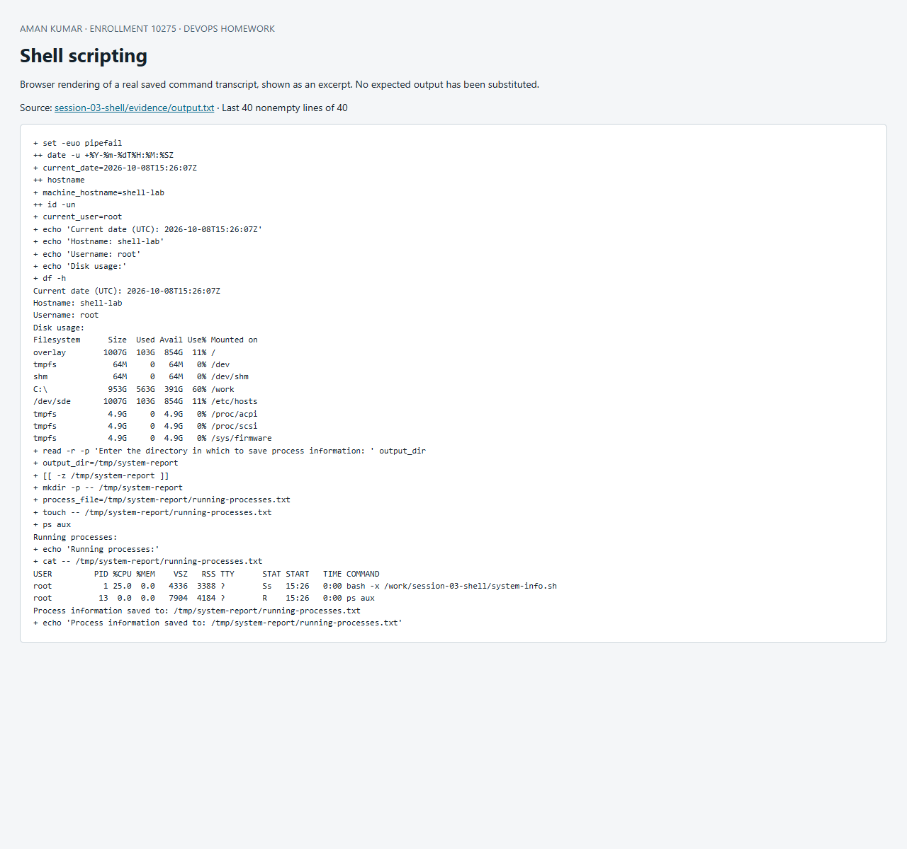

# Session 3: System information shell script

**Student:** Aman · **Executed:** 8 October 2026

[system-info.sh](system-info.sh) prints the date, hostname, user, disk usage and running processes. It asks for an output directory and writes the process list to `running-processes.txt`.

## Run

```bash
bash session-03-shell/system-info.sh
# At the prompt enter: ./system-report
cat ./system-report/running-processes.txt
```

Reproduce the recorded, isolated run from the repository root after building the foundations image in [Sessions 1–2](../session-01-02-linux/README.md):

```bash
printf '/tmp/system-report\n' | docker run --rm -i --hostname shell-lab \
  -v "$PWD:/work:ro" devops-homework-foundations:local \
  bash -x /work/session-03-shell/system-info.sh
```

## Requirement mapping

| Requirement | Implementation |
|---|---|
| Current date | `date -u` stored in `current_date` |
| Hostname | `hostname` stored in `machine_hostname` |
| Username | `id -un` stored in `current_user` |
| Disk usage | `df -h` |
| Running processes | `ps aux` |
| Variables | Quoted date, hostname, user, directory and filename variables |
| User input | `read -r -p` |
| Create directory and file | `mkdir -p --`, `touch --` |
| Output redirection | `ps aux > "$process_file"` |
| Display output | `echo` and `cat` |

`set -euo pipefail` stops unexpected command failures and unset variables. Quoted paths support spaces, and an empty directory input is rejected. `>` overwrites an earlier report in the requested directory. The evidence run uses `/tmp` inside a disposable container.

## All command output

[Raw transcript](evidence/output.txt). The `+` lines come from `bash -x`; they show the variables and commands executed. Bash displays the `read -p` prompt only for terminal input, so the piped evidence run records the command without an interactive prompt.

```text
+ set -euo pipefail
++ date -u +%Y-%m-%dT%H:%M:%SZ
+ current_date=2026-10-08T15:26:07Z
++ hostname
+ machine_hostname=shell-lab
++ id -un
+ current_user=root
+ echo 'Current date (UTC): 2026-10-08T15:26:07Z'
+ echo 'Hostname: shell-lab'
+ echo 'Username: root'
+ echo 'Disk usage:'
+ df -h
Current date (UTC): 2026-10-08T15:26:07Z
Hostname: shell-lab
Username: root
Disk usage:
Filesystem      Size  Used Avail Use% Mounted on
overlay        1007G  103G  854G  11% /
tmpfs            64M     0   64M   0% /dev
shm              64M     0   64M   0% /dev/shm
C:\             953G  563G  391G  60% /work
/dev/sde       1007G  103G  854G  11% /etc/hosts
tmpfs           4.9G     0  4.9G   0% /proc/acpi
tmpfs           4.9G     0  4.9G   0% /proc/scsi
tmpfs           4.9G     0  4.9G   0% /sys/firmware
+ read -r -p 'Enter the directory in which to save process information: ' output_dir
+ output_dir=/tmp/system-report
+ [[ -z /tmp/system-report ]]
+ mkdir -p -- /tmp/system-report
+ process_file=/tmp/system-report/running-processes.txt
+ touch -- /tmp/system-report/running-processes.txt
+ ps aux
Running processes:
+ echo 'Running processes:'
+ cat -- /tmp/system-report/running-processes.txt
USER         PID %CPU %MEM    VSZ   RSS TTY      STAT START   TIME COMMAND
root           1 25.0  0.0   4336  3388 ?        Ss   15:26   0:00 bash -x /work/session-03-shell/system-info.sh
root          13  0.0  0.0   7904  4184 ?        R    15:26   0:00 ps aux
Process information saved to: /tmp/system-report/running-processes.txt
+ echo 'Process information saved to: /tmp/system-report/running-processes.txt'

```


## Screenshot of captured output

This browser screenshot renders an excerpt from the linked actual command log. Full output remains available in the evidence files above.


