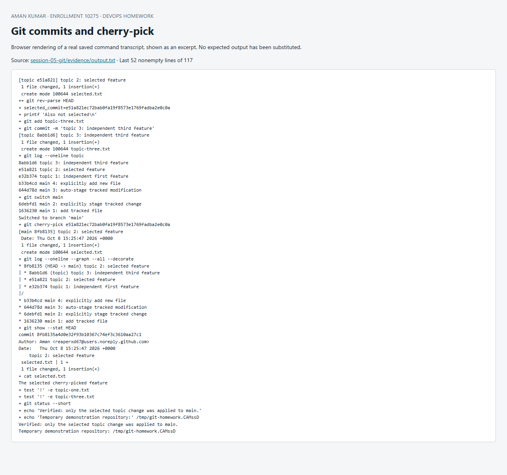

# Session 5: Git commits and cherry-pick

**Student:** Aman · **Executed:** 8 October 2026

[git-lab.sh](git-lab.sh) creates a temporary repository, demonstrates staging behavior, makes four main commits and three topic commits, and cherry-picks only the second topic commit. The exercise repository and its local Git identity configuration disappear with the lab container. The submission repository's history is unaffected.

## Run

From the repository root after building the [foundations image](../session-01-02-linux/Dockerfile):

```bash
docker run --rm --hostname git-lab -v "$PWD:/work:ro" \
  devops-homework-foundations:local bash /work/session-05-git/git-lab.sh
```

## `git commit -a -m` versus `git commit -m`

`-m` supplies the message; by itself it commits changes already in the index. `-a` also stages modifications and deletions of tracked files. It does not add untracked files. The exercise shows an unstaged modification causing plain `git commit -m` to fail, then succeeds after `git add`. Next, `git commit -a -m` commits a tracked modification while leaving `new.txt` untracked; explicitly adding it creates the fourth main commit. [Git commit manual](https://git-scm.com/docs/git-commit).

## Cherry-pick workflow

1. Create and list four commits on `main`.
2. Create `topic` with `git switch -c topic`.
3. Add three independent commits: `topic-one.txt`, `selected.txt`, `topic-three.txt`.
4. Save the second commit's hash with `git rev-parse HEAD` and list the branch log.
5. Switch to `main` and run `git cherry-pick "$selected_commit"`.
6. Verify `selected.txt` exists and both other topic files are absent.
7. Display `git log --oneline --graph --all --decorate`, `git show --stat HEAD` and the clean working tree.

Cherry-pick replays the selected commit's changes on the current branch. It creates a new commit with a new parent/hash; it does not merge all topic commits. A conflicting edit would require resolving files, `git add`, and `git cherry-pick --continue`, or `--abort` to abandon the operation. [Git cherry-pick manual](https://git-scm.com/docs/git-cherry-pick).

## Recorded commands and output

The [complete transcript](evidence/output.txt) includes actual commit hashes and the final graph. The intentional unstaged-change error is expected.

```text
+ date -u
Thu Oct  8 15:25:47 UTC 2026
+ git --version
git version 2.43.0
++ mktemp -d /tmp/git-homework.XXXXXX
+ lab_dir=/tmp/git-homework.CAMssD
+ cd /tmp/git-homework.CAMssD
+ git init -b main
Initialized empty Git repository in /tmp/git-homework.CAMssD/.git/
+ git config user.name Aman
+ git config user.email reaperxd67@users.noreply.github.com
+ git config commit.gpgsign false
+ printf 'Initial tracked file\n'
+ git add tracked.txt
+ git commit -m 'main 1: add tracked file'
[main (root-commit) 1636230] main 1: add tracked file
 1 file changed, 1 insertion(+)
 create mode 100644 tracked.txt
+ printf 'Manual staging demonstration\n'
+ git commit -m 'This must fail: change is unstaged'
On branch main
Changes not staged for commit:
  (use "git add <file>..." to update what will be committed)
  (use "git restore <file>..." to discard changes in working directory)
	modified:   tracked.txt

no changes added to commit (use "git add" and/or "git commit -a")
Expected: git commit -m does not stage the modified file.
+ echo 'Expected: git commit -m does not stage the modified file.'
+ git add tracked.txt
+ git commit -m 'main 2: explicitly stage tracked change'
[main 6debfd1] main 2: explicitly stage tracked change
 1 file changed, 1 insertion(+)
+ printf 'Automatically staged tracked change\n'
+ printf 'New untracked file\n'
+ git status --short
 M tracked.txt
?? new.txt
+ git commit -a -m 'main 3: auto-stage tracked modification'
[main 644d78d] main 3: auto-stage tracked modification
 1 file changed, 1 insertion(+)
+ git status --short
?? new.txt
+ git ls-files
tracked.txt
+ git add new.txt
+ git commit -m 'main 4: explicitly add new file'
[main b33b4cd] main 4: explicitly add new file
 1 file changed, 1 insertion(+)
 create mode 100644 new.txt
+ git log --oneline main
b33b4cd main 4: explicitly add new file
644d78d main 3: auto-stage tracked modification
6debfd1 main 2: explicitly stage tracked change
1636230 main 1: add tracked file
+ git switch -c topic
Switched to a new branch 'topic'
+ printf 'Not selected\n'
+ git add topic-one.txt
+ git commit -m 'topic 1: independent first feature'
[topic e32b374] topic 1: independent first feature
 1 file changed, 1 insertion(+)
 create mode 100644 topic-one.txt
+ printf 'The selected cherry-picked feature\n'
+ git add selected.txt
+ git commit -m 'topic 2: selected feature'
[topic e51a821] topic 2: selected feature
 1 file changed, 1 insertion(+)
 create mode 100644 selected.txt
++ git rev-parse HEAD
+ selected_commit=e51a821ec72bab0fa19f8573e1769fadba2e0c0a
+ printf 'Also not selected\n'
+ git add topic-three.txt
+ git commit -m 'topic 3: independent third feature'
[topic 8abb1d6] topic 3: independent third feature
 1 file changed, 1 insertion(+)
 create mode 100644 topic-three.txt
+ git log --oneline topic
8abb1d6 topic 3: independent third feature
e51a821 topic 2: selected feature
e32b374 topic 1: independent first feature
b33b4cd main 4: explicitly add new file
644d78d main 3: auto-stage tracked modification
+ git switch main
6debfd1 main 2: explicitly stage tracked change
1636230 main 1: add tracked file
Switched to branch 'main'
+ git cherry-pick e51a821ec72bab0fa19f8573e1769fadba2e0c0a
[main 8fb8135] topic 2: selected feature
 Date: Thu Oct 8 15:25:47 2026 +0000
 1 file changed, 1 insertion(+)
 create mode 100644 selected.txt
+ git log --oneline --graph --all --decorate
* 8fb8135 (HEAD -> main) topic 2: selected feature
| * 8abb1d6 (topic) topic 3: independent third feature
| * e51a821 topic 2: selected feature
| * e32b374 topic 1: independent first feature
|/  
* b33b4cd main 4: explicitly add new file
* 644d78d main 3: auto-stage tracked modification
* 6debfd1 main 2: explicitly stage tracked change
* 1636230 main 1: add tracked file
+ git show --stat HEAD
commit 8fb8135a4d0e32f93b10367c74ef3c3610aa27c1
Author: Aman <reaperxd67@users.noreply.github.com>
Date:   Thu Oct 8 15:25:47 2026 +0000

    topic 2: selected feature

 selected.txt | 1 +
 1 file changed, 1 insertion(+)
+ cat selected.txt
The selected cherry-picked feature
+ test '!' -e topic-one.txt
+ test '!' -e topic-three.txt
+ git status --short
+ echo 'Verified: only the selected topic change was applied to main.'
+ echo 'Temporary demonstration repository:' /tmp/git-homework.CAMssD
Verified: only the selected topic change was applied to main.
Temporary demonstration repository: /tmp/git-homework.CAMssD

```


## Screenshot of captured output

This browser screenshot renders an excerpt from the linked actual command log. Full output remains available in the evidence files above.


