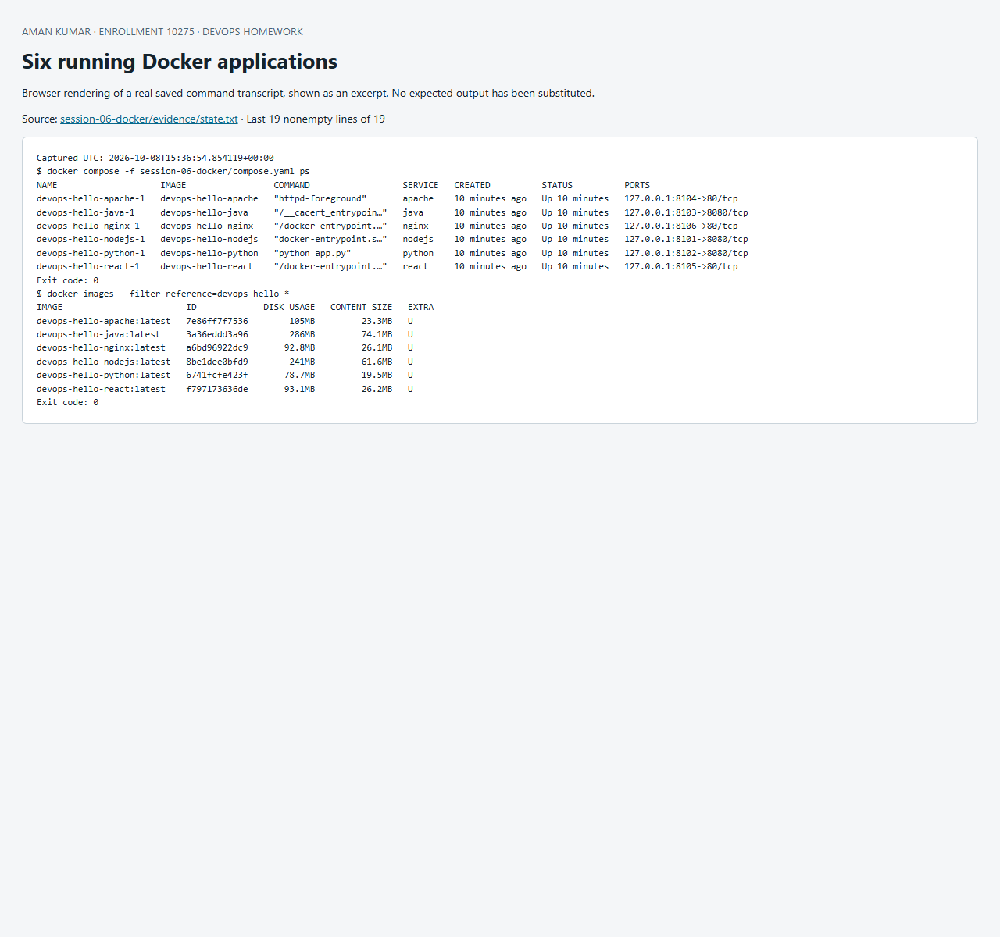

# Session 6 — Docker fundamentals

**Aman Kumar · Enrollment 10275**

Six separate Hello World applications were built and run as containers. The source and Dockerfile for each application are in the exact folders requested by the assignment.

| Application | Source | Published URL |
|---|---|---|
| Node.js | [nodejs-app](nodejs-app) | http://localhost:8101 |
| Python | [python-app](python-app) | http://localhost:8102 |
| Java | [java-app](java-app) | http://localhost:8103 |
| Apache | [Apache-app](Apache-app) | http://localhost:8104 |
| React | [React-app](React-app) | http://localhost:8105 |
| Nginx | [nginx-app](nginx-app) | http://localhost:8106 |

## Reproduce

From this directory with Docker Desktop's Linux engine running:

```sh
docker compose build
docker compose up -d
docker compose ps
curl http://localhost:8101
curl http://localhost:8102
curl http://localhost:8103
curl http://localhost:8104
curl http://localhost:8105
curl http://localhost:8106
docker compose down
```

On Windows, `powershell -ExecutionPolicy Bypass -File verify.ps1` automates builds, startup and all HTTP checks. React's response is an HTML shell; the browser runs the compiled React bundle to render its heading. Java uses the JDK HTTP server and a separate JRE runtime stage. Node and Python use their standard-library HTTP servers. These small servers are lab examples, not production hosting recommendations.

## Actual evidence

All six endpoints returned HTTP 200. [HTTP transcript](evidence/run.txt) and [container state and image evidence](evidence/state.txt) record the real results. The screenshot shows React executing in the browser:


## What I learned

An image is a reusable filesystem/configuration template; a container is a running instance with its own writable layer. `docker build` executes the Dockerfile, while `docker run` or Compose starts a container. `EXPOSE` documents an internal port; the Compose `ports` mapping actually publishes it. Binding to `127.0.0.1` keeps these demonstrations local. Multi-stage builds avoid shipping build tools in the final image. Docker's build cache reuses unchanged layers; copying dependency manifests before source helps avoid unnecessary reinstallations.

Sources: [Docker multi-stage builds](https://docs.docker.com/build/building/multi-stage/), [Dockerfile reference](https://docs.docker.com/reference/dockerfile/).


## Screenshot of captured output

This browser screenshot renders an excerpt from the linked actual command log. Full output remains available in the evidence files above.


