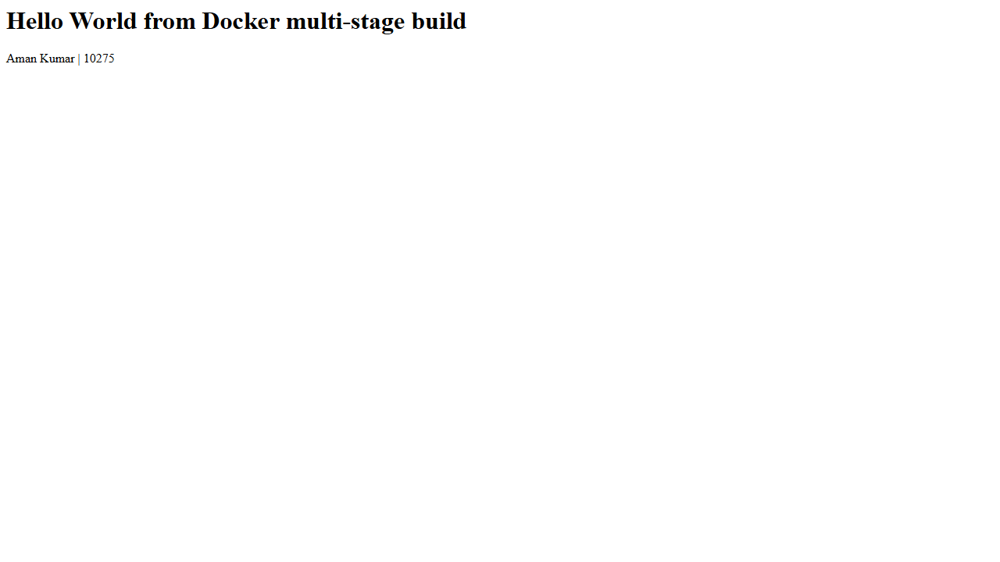
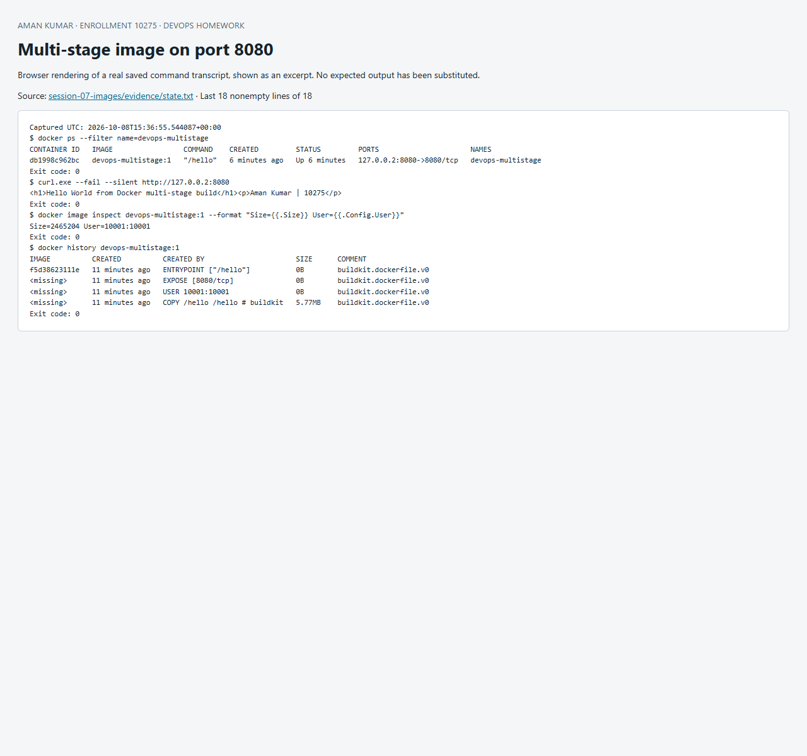

# Session 7 — Docker images and multi-stage builds

**Name:** Aman Kumar  
**Enrollment number:** 10275

The Go build stage compiles a static HTTP server. The final `scratch` stage contains only that executable and runs as UID 10001. It displays the exact required text: **Hello World from Docker multi-stage build**.

## Commands

```sh
git clone https://github.com/ReaperXD67/devops-homework.git
cd devops-homework/session-07-images
docker build -t devops-multistage:1 .
docker run -d --name devops-multistage -p 127.0.0.2:8080:8080 devops-multistage:1
docker ps --filter name=devops-multistage
curl http://127.0.0.2:8080
docker image inspect devops-multistage:1
docker history devops-multistage:1
# Cleanup this lab only:
docker rm -f devops-multistage
```

The host port is **8080**. This machine already had another project bound to `127.0.0.1:8080`, so the lab uses the separate loopback address **127.0.0.2:8080**. Both host and container ports remain 8080, and the existing project was left running.

The brief does not provide a URL for its multi-stage example. This repository provides an original equivalent example, and the clone command above retrieves the exact submitted implementation.

## Actual results

[Execution transcript](evidence/run.txt) · [docker ps, image and HTTP output](evidence/state.txt) · [Build from a fresh Git clone](evidence/clone-build.txt)



The `docker history` output shows the final executable copy and runtime configuration, without the Go compiler or source tree. Reported image sizes differ between compressed content, unpacked layers and Docker's image store; the evidence preserves the command's actual values rather than treating them as interchangeable.

## Three application types

Node.js, Python and Java were also built and deployed, with HTTP 200 results, in [Session 6](../session-06-docker/README.md). Its Compose configuration and evidence demonstrate all three concurrently.

## Lessons

Name build stages (`AS build`) and use `COPY --from=build` to select only the artifact. A static executable can run in `scratch`; dynamically linked binaries need their runtime libraries. Port publishing is independent of image creation. An existing port collision should be diagnosed rather than stopping unrelated workloads.

Source: [Docker multi-stage builds](https://docs.docker.com/build/building/multi-stage/).


## Screenshot of captured output

This browser screenshot renders an excerpt from the linked actual command log. Full output remains available in the evidence files above.


