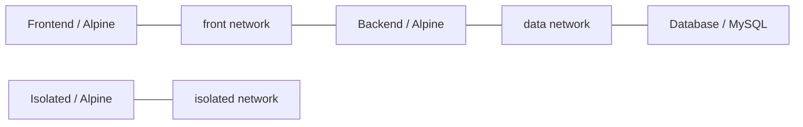
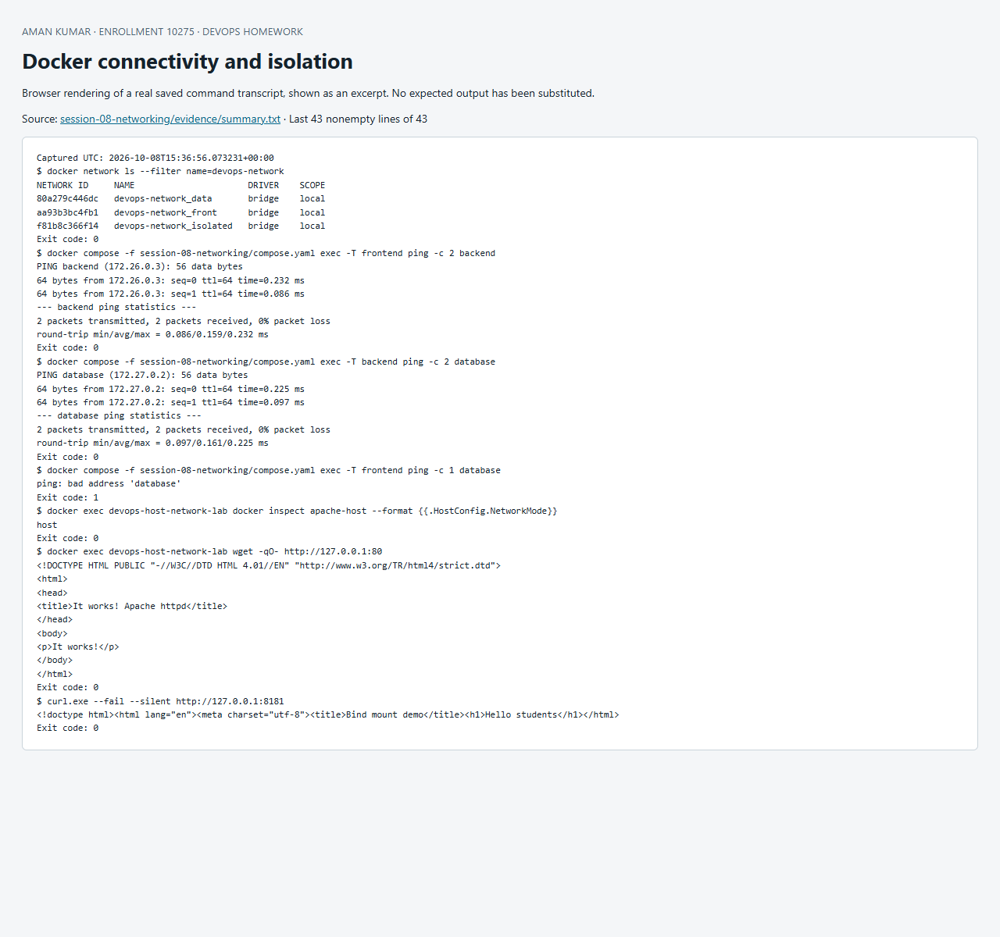

# Session 8 — Docker networking and volumes

**Aman Kumar · Enrollment 10275**

## 1. Three networks and container connectivity

The [Compose file](compose.yaml) creates `front`, `data`, and `isolated` bridge networks. Frontend and backend use Alpine; the database uses MySQL 8.4. Backend joins **two** networks. An extra isolated Alpine container makes the third network's isolation inspectable.



```sh
docker compose up -d
docker network ls --filter name=devops-network
docker compose exec -T frontend ping -c 2 backend
docker compose exec -T backend ping -c 2 database
docker compose exec -T frontend ping -c 1 database
docker inspect "$(docker compose ps -q backend)"
```

The first two pings succeeded. Frontend could not resolve `database`, because it does not share the database's network. This verifies Docker network membership/DNS separation, not database authentication or SQL authorization. MySQL gets a random ephemeral root password; its value is never published. Its temporary data storage is appropriate only for this disposable lab.

## 2. Apache using host networking

Docker Desktop host networking depends on platform settings. To demonstrate Linux host-network semantics without changing those settings, [verify.sh](verify.sh) starts a disposable Docker-in-Docker host. Inside it:

```sh
docker run -d --name apache-host --network host httpd:2.4-alpine
docker inspect apache-host --format '{{.HostConfig.NetworkMode}}'
wget -qO- http://127.0.0.1:80
```

The mode is `host`, and Apache is accessed directly on **port 80 of the isolated Linux host**. The outer lab container publishes that host's port 80 to Windows `127.0.0.1:8180`. No port mapping is used for the inner Apache container. `httpd` is the Docker Official Image for Apache HTTP Server.

The Docker-in-Docker host is privileged solely for this local exercise; it is not a deployment pattern for the application.

## 3. Bind mount

```sh
docker run -d --name devops-bind-demo -p 127.0.0.1:8181:80 \
  --mount "type=bind,source=$(pwd)/site,target=/usr/share/nginx/html,readonly" nginx:stable-alpine
curl http://127.0.0.1:8181
printf '<h1>Hello students - updated without restart</h1>\n' > site/index.html
curl http://127.0.0.1:8181
docker inspect devops-bind-demo --format '{{.State.StartedAt}}'
```

The first response contained `Hello students`; the second showed the edited content immediately. The container start timestamp remained unchanged. The script restores the original file after checking. A read-only mount prevents the container writing to the host directory, while host-side edits still become visible inside it.


## 4. Overlay network research

Bridge networks connect containers on one Docker host. Swarm overlay networks connect services/containers across multiple participating hosts. Managers coordinate network membership, while VXLAN encapsulates traffic between host endpoints. An attachable overlay lets standalone containers join as well as Swarm services. Typical uses include multi-host web/API/database service communication and service discovery.

Swarm nodes require the documented management, gossip and overlay ports between trusted hosts (2377/TCP, 7946/TCP+UDP, 4789/UDP). Overlay application data encryption is opt-in with `--opt encrypted` and has overhead; Swarm management-plane encryption does not mean all application traffic is automatically encrypted. Never expose overlay ports to untrusted networks.

Illustrative commands for an actual multi-host Swarm, **not claimed as executed in this lab**:

```sh
docker swarm init --advertise-addr <manager-private-ip>
# On another host, use the worker join command returned by the manager.
docker network create --driver overlay --attachable course-overlay
docker service create --name web --network course-overlay --replicas 2 nginx:stable-alpine
docker service ps web
```

## Evidence and cleanup

[Full actual command transcript](evidence/run.txt) · [Focused connectivity output](evidence/summary.txt)

Run from WSL/Linux: `bash verify.sh`. For cleanup, run `docker compose down` and `docker rm -f devops-bind-demo devops-host-network-lab`; these names belong only to this exercise. Delete the lab host only after retaining its evidence.

Sources: [Docker host networking](https://docs.docker.com/engine/network/drivers/host/), [bind mounts](https://docs.docker.com/engine/storage/bind-mounts/), [overlay networks](https://docs.docker.com/engine/network/drivers/overlay/).


## Screenshot of captured output

This browser screenshot renders an excerpt from the linked actual command log. Full output remains available in the evidence files above.


