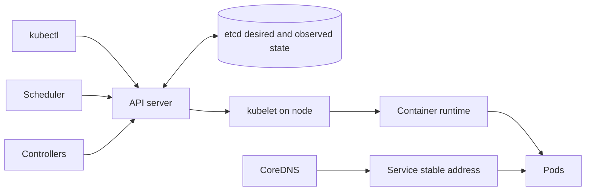
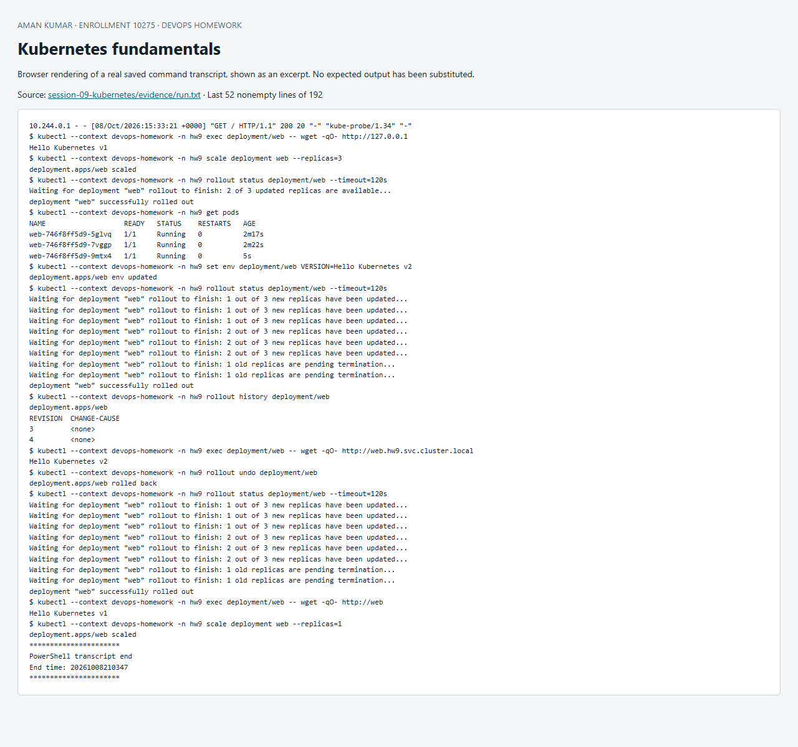

# Session 09 — Kubernetes fundamentals

## Installation and architecture

The lab uses Docker Desktop on Windows, Minikube's Docker driver, and the named profile `devops-homework`. Portable tools do not modify other clusters.

```powershell
minikube start -p devops-homework --driver=docker --cpus=3 --memory=4096 --kubernetes-version=v1.34.0 --addons=metrics-server,ingress --wait=all
minikube status -p devops-homework
kubectl --context devops-homework cluster-info
```



The API server validates requests and persists state in etcd. The scheduler selects nodes for unscheduled Pods. Controllers reconcile desired state: a Deployment creates ReplicaSets, and a ReplicaSet replaces missing Pods. The kubelet coordinates container creation through the container runtime. Network rules route Service traffic to ready Pod endpoints. CoreDNS provides discovery. Minikube runs these components together on a local node; production clusters usually separate and replicate the control plane.

## Kubernetes Basics tutorial mapping

| Tutorial objective | Hands-on action in Run-Lab.ps1 | What to check |
|---|---|---|
| Create cluster | Installation command above; cluster-info, nodes | API available and node Ready |
| Deploy app | Apply basics.yaml | Deployment owns ReplicaSet and two Pods |
| Explore | get, describe, logs, exec | Labels, events, logs and HTTP response |
| Expose | ClusterIP Service | HTTP succeeds using Service DNS from inside cluster |
| Scale | 2 → 3 replicas | Three ready Pods; same Service name |
| Update | VERSION v1 → v2 | New ReplicaSet, rollout complete, v2 response |
| Roll back | rollout undo | Old application response restored |

[`basics.yaml`](basics.yaml) is a small Nginx equivalent of the tutorial workload. Its page is generated from an environment variable so a Pod-template change produces a visible application version. Pod IPs are replaceable; use Service DNS for communication. A namespace scopes names and simplifies cleanup.

References: [Kubernetes Basics](https://kubernetes.io/docs/tutorials/kubernetes-basics/), [architecture](https://kubernetes.io/docs/concepts/architecture/), [Minikube installation](https://minikube.sigs.k8s.io/docs/start/).

## Reproduce and evidence

Run from this directory in PowerShell with `kubectl` on PATH and the dedicated `devops-homework` Minikube context:

```powershell
./Run-Lab.ps1
```

The script records the actual commands and output in [`evidence/run.txt`](evidence/run.txt). Expected failure commands are explicitly marked `TryK`; other failures stop the run. Resources are confined to the session namespace. Cleanup is `kubectl --context devops-homework delete namespace hw9`; persistent homework data in that namespace is deleted by cleanup. Never run cleanup against a production context.


## Recorded result

The recorded run on 8 October 2026 used Kubernetes v1.34.0 on a Ready Minikube node. The application returned `Hello Kubernetes v1`, changed to `Hello Kubernetes v2`, then returned v1 after rollback. Scaling to three Pods is visible in the transcript. [Minikube status](evidence/minikube-status.txt).


## Screenshot of captured output

This browser screenshot renders an excerpt from the linked actual command log. Full output remains available in the evidence files above.


