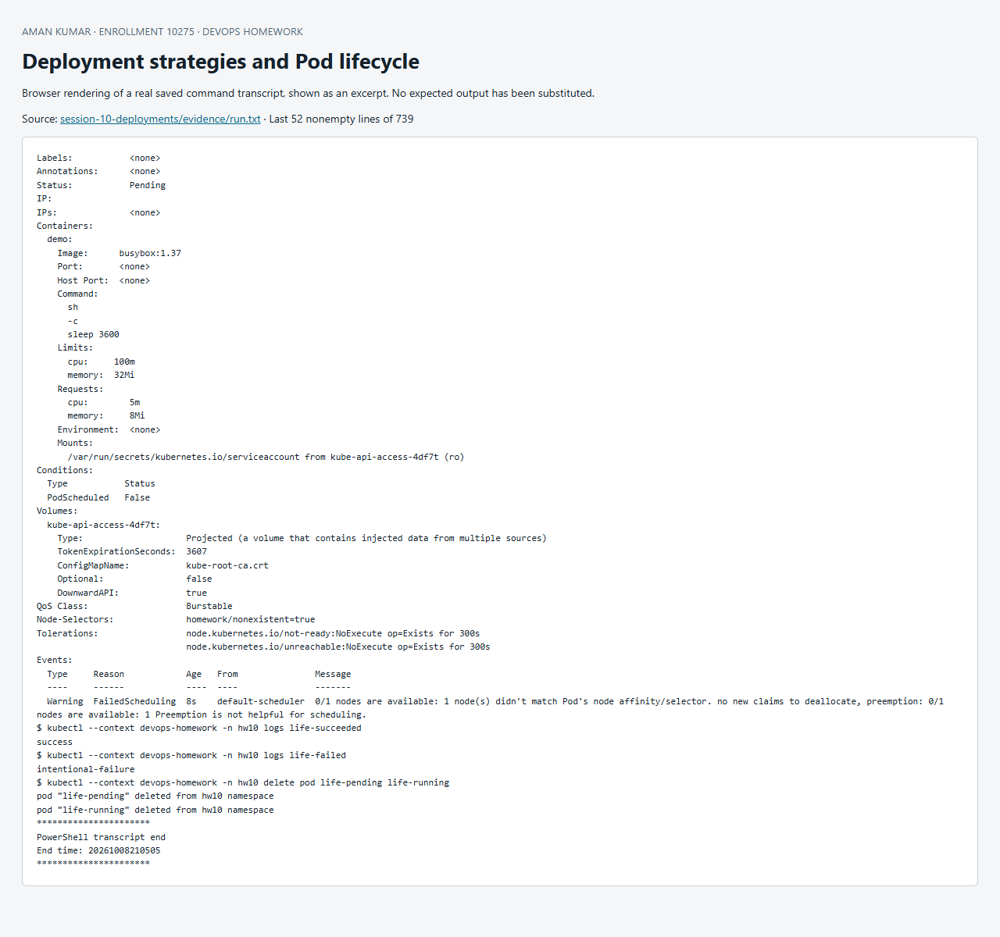

# Session 10 — Pods, ReplicaSets and deployment strategies

## Four strategies

| YAML | Implementation | Observation and tradeoff |
|---|---|---|
| [01-rolling.yaml](01-rolling.yaml) | Two replicas, maxSurge 1, maxUnavailable 0; set VERSION=rolling-v2 | New ReplicaSet grows while the old shrinks; readiness protects availability but old/new versions coexist briefly |
| [02-blue-green.yaml](02-blue-green.yaml) | Separate blue and green Deployments; change Service selector | Response changes from blue-v1 to green-v2. Fast reversal by switching selector back, but duplicate capacity required |
| [03-canary.yaml](03-canary.yaml) | Four stable and one canary ready endpoint behind one Service | About 20% of **new connections** reach canary under balanced endpoint selection. 100 independent wget requests show both versions; this is approximate, not a guaranteed per-request traffic policy |
| [04-recreate.yaml](04-recreate.yaml) | strategy.type Recreate; set VERSION=recreate-v2 | Old ReplicaSet goes to zero before new Pods start. The Deployment event timeline records scale-down before scale-up; downtime is expected |

The script captures Pod/ReplicaSet states, version HTTP responses and the Deployment events. A production percentage-based canary should use an ingress controller or service mesh with explicit traffic weights. Existing keep-alive connections and session affinity affect the simple replica-ratio demonstration.

## Pod lifecycle

[`05-lifecycle.yaml`](05-lifecycle.yaml) applies a separate example of each reproducible terminal/nonterminal phase and captures `get`, `describe` and logs:

| Pod | Phase / reason | Explanation |
|---|---|---|
| life-running | Running | A scheduled container sleeps; it has started successfully |
| life-succeeded | Succeeded / Completed | Exit code 0 with restartPolicy Never |
| life-failed | Failed / Error | Intentional exit code 1 with restartPolicy Never |
| life-pending | Pending / FailedScheduling | Node selector matches no node; no container can start |

Pod phases are Pending, Running, Succeeded, Failed and Unknown. Unknown means state cannot be obtained, often because node communication failed; the lab does not intentionally disconnect the cluster. `ContainerCreating`, `CrashLoopBackOff` and `Terminating` are status/reason displays, not additional Pod phases. Session 14 reproduces container failures. Init, scheduling, readiness, termination and restart decisions appear in `describe`. A deleted Pod is not restarted as the same object: a controller creates a replacement with a new UID.

References: [Deployments](https://kubernetes.io/docs/concepts/workloads/controllers/deployment/), [Pod lifecycle](https://kubernetes.io/docs/concepts/workloads/pods/pod-lifecycle/).

## Reproduce and evidence

Run from this directory in PowerShell with `kubectl` on PATH and the dedicated `devops-homework` Minikube context:

```powershell
./Run-Lab.ps1
```

The script records the actual commands and output in [`evidence/run.txt`](evidence/run.txt). Expected failure commands are explicitly marked `TryK`; other failures stop the run. Resources are confined to the session namespace. Cleanup is `kubectl --context devops-homework delete namespace hw10`; persistent homework data in that namespace is deleted by cleanup. Never run cleanup against a production context.


## Recorded result

The recorded run on 8 October 2026 returned `rolling-v2`; blue-green traffic changed from `blue-v1` to `green-v2`. The 100-request canary sample returned stable-v1 76 times and canary-v2 24 times (24% observed; 20% nominal endpoint ratio). Recreate scale-down/scale-up events and all four lifecycle examples are recorded.


## Screenshot of captured output

This browser screenshot renders an excerpt from the linked actual command log. Full output remains available in the evidence files above.


