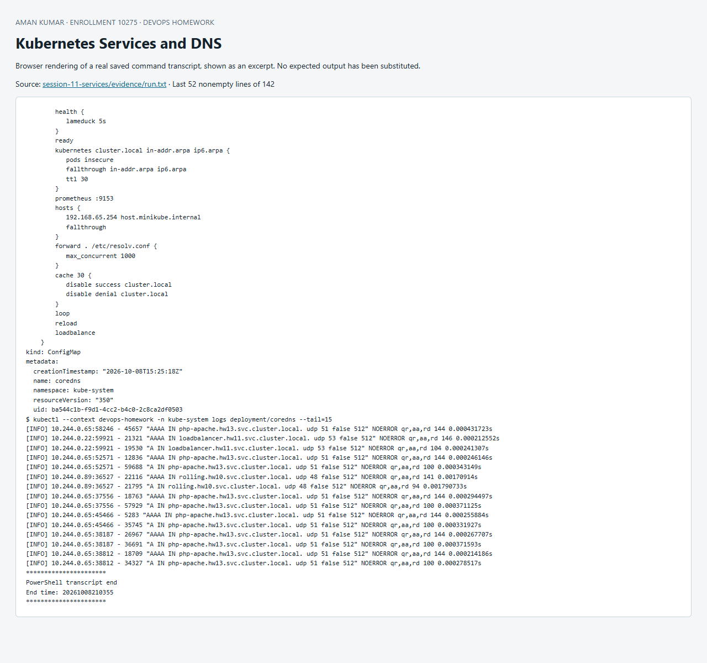

# Session 11 — Kubernetes networking and Services

[`services.yaml`](services.yaml) deploys a two-replica web application and all five requested Service patterns. Headless is a Service configuration (`clusterIP: None`), not a separate value of `spec.type`.

| Service | Meaning | Verification |
|---|---|---|
| ClusterIP | Stable internal virtual IP | wget http://clusterip; nslookup full DNS name |
| NodePort | ClusterIP plus port on node | wget http://NODE_INTERNAL_IP:NODE_PORT from a cluster Pod |
| LoadBalancer | Requests an external load balancer, also has internal routing | Internal HTTP verification in run.txt; external test in loadbalancer.txt when tunnel is running |
| ExternalName | DNS CNAME to example.com, no proxy or endpoints | nslookup externalname.hw11.svc.cluster.local shows alias and external answer |
| Headless | DNS resolves directly to ready Pod IPs | nslookup headless.hw11.svc.cluster.local and HTTP request |

On the Docker driver for Windows, the node IP is inside Docker's network. External LoadBalancer access requires `minikube tunnel -p devops-homework` in another terminal. A pending external IP alone is not successful external connectivity; evidence distinguishes the two. ExternalName does not rewrite HTTP Host or TLS names, so it should not be treated as an HTTP reverse proxy.

## Object comparisons

| Aspect | Deployment | ReplicaSet |
|---|---|---|
| Purpose | Declarative application rollout and history | Maintain desired count of matching Pods |
| Pod management | Manages ReplicaSets, which manage Pods | Directly creates/replaces Pods |
| Scaling | Set replicas on Deployment | Set replicas if standalone; avoid editing one owned by Deployment |
| Rolling updates | Creates new ReplicaSet and coordinates migration | Does not provide deployment rollout strategy/history |
| Relationship | Parent controller | Child controller for one Pod-template revision |

| Aspect | Deployment | DaemonSet | StatefulSet |
|---|---|---|---|
| Typical use | Stateless web/API | Node agent, log collector, CNI component | Database or clustered stateful application |
| Pod creation | Interchangeable replicas | One Pod per eligible node | Stable ordinal identity such as db-0 |
| Scaling | Replica count or HPA | Follows eligible node count | Replica count, often ordered creation |
| Networking | Shared Service, replaceable Pod names | Node-local/agent endpoints | Stable hostname through governing headless Service |
| Storage | Usually external/shared service or optional PVC | Often reads node-local files | volumeClaimTemplates give per-Pod persistent claims |
| Example | Web frontend | Fluent Bit | Stateful database operator workload |

ReplicaSet manages **how many** Pods exist. A Service provides **where clients connect** and selects eligible endpoints by labels; it does not create or repair Pods. Client → Service DNS → virtual IP/port → network forwarding → ready endpoint Pod. Readiness affects endpoint availability; a matching label alone does not guarantee a healthy server.

Detailed DNS notes: [`fqdn/README.md`](fqdn/README.md), [`coredns/README.md`](coredns/README.md).

References: [Service concepts](https://kubernetes.io/docs/concepts/services-networking/service/), [workload controllers](https://kubernetes.io/docs/concepts/workloads/controllers/).

## Reproduce and evidence

Run from this directory in PowerShell with `kubectl` on PATH and the dedicated `devops-homework` Minikube context:

```powershell
./Run-Lab.ps1
```

The script records the actual commands and output in [`evidence/run.txt`](evidence/run.txt). Expected failure commands are explicitly marked `TryK`; other failures stop the run. Resources are confined to the session namespace. Cleanup is `kubectl --context devops-homework delete namespace hw11`; persistent homework data in that namespace is deleted by cleanup. Never run cleanup against a production context.


## Recorded result

The recorded run on 8 October 2026 verified DNS and HTTP for the internal Service patterns, CNAME resolution for ExternalName, and NodePort connectivity. A real `minikube tunnel` assigned `127.0.0.1`; a host HTTP request returned `200 OK` and `Hello from Kubernetes Services`. See [external LoadBalancer evidence](evidence/loadbalancer.txt). The temporary tunnel was stopped after verification; restart it for host access.


## Screenshot of captured output

This browser screenshot renders an excerpt from the linked actual command log. Full output remains available in the evidence files above.


