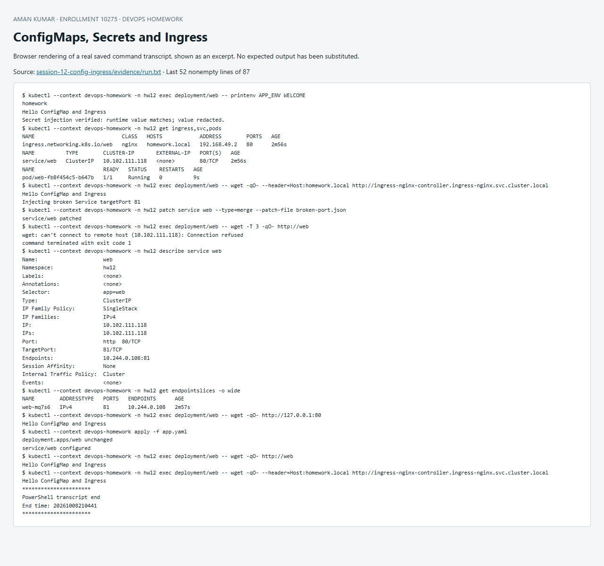

# Session 12 — ConfigMaps, Secrets and Ingress

## Configuration and Secret injection

[`configmap.yaml`](configmap.yaml) holds APP_ENV and WELCOME. [`app.yaml`](app.yaml) injects them through `envFrom`; `printenv APP_ENV WELCOME` verifies values inside the container. Environment injection is a startup snapshot: restart Pods after changing the source if using environment variables. Mounted ConfigMap volumes normally update eventually, except subPath mounts.

[`secret.example.yaml`](secret.example.yaml) documents the expected Secret schema with a placeholder. The run script creates a unique disposable token only in memory, submits it to Kubernetes, injects it into the Pod and compares the retrieved value without printing it. Evidence states whether it matched. Actual credential values and generated Secret YAML are never committed. Base64 is encoding, not encryption; use least-privilege RBAC, encryption at rest and an external secret manager for real workloads. Shell history, process arguments and cluster-admin access are additional reasons to use disposable credentials for this local exercise.

## Ingress routing

[`ingress.yaml`](ingress.yaml) routes Host `homework.local`, path `/`, to Service `web:80`. Minikube's `ingress` addon supplies an Nginx ingress controller. The script sends an HTTP request to the controller Service **with the Host header** and confirms the application response, exercising the ingress routing layer.

| Ingress | Ingress controller |
|---|---|
| Kubernetes API object describing host/path/TLS routing intent | Running implementation that watches the objects and configures a proxy/load balancer |
| Does not itself receive traffic | Receives and routes traffic |
| Example: homework.local / → web:80 | Example: Minikube ingress-nginx addon, Traefik |

Both are needed for this API-based demo: a route with no controller has no serving implementation, while a controller with no matching route normally returns its default response. For new production systems also evaluate the Gateway API and current controller maintenance/security guidance.

## Troubleshooting lab

The supplied upstream repository was unavailable (GitHub 404), so this is an original, reproducible fault using the session application. The script changes Service targetPort from 80 to 81, captures the failed HTTP request, inspects Service and EndpointSlices, then proves localhost:80 works inside the Pod. Root cause: the Service selected the correct Pod but forwarded to a port without a listener. Reapplying app.yaml restores port 80; Service and Ingress HTTP requests then verify recovery. See [`broken-port.json`](broken-port.json) and the before/after transcript.

References: [ConfigMaps](https://kubernetes.io/docs/concepts/configuration/configmap/), [Secrets](https://kubernetes.io/docs/concepts/configuration/secret/), [Ingress](https://kubernetes.io/docs/concepts/services-networking/ingress/).

## Reproduce and evidence

Run from this directory in PowerShell with `kubectl` on PATH and the dedicated `devops-homework` Minikube context:

```powershell
./Run-Lab.ps1
```

The script records the actual commands and output in [`evidence/run.txt`](evidence/run.txt). Expected failure commands are explicitly marked `TryK`; other failures stop the run. Resources are confined to the session namespace. Cleanup is `kubectl --context devops-homework delete namespace hw12`; persistent homework data in that namespace is deleted by cleanup. Never run cleanup against a production context.


## Recorded result

The recorded run on 8 October 2026 printed both ConfigMap values, confirmed the generated Secret value matched without exposing it, and returned `Hello ConfigMap and Ingress` through the Nginx controller. The deliberate targetPort 81 fault produced connection refused; restoring port 80 recovered both Service and Ingress requests.

A host-side request through a temporary port-forward to the controller also returned HTTP 200 with the correct Host header. See [host ingress evidence](evidence/ingress-host.txt).


## Screenshot of captured output

This browser screenshot renders an excerpt from the linked actual command log. Full output remains available in the evidence files above.


