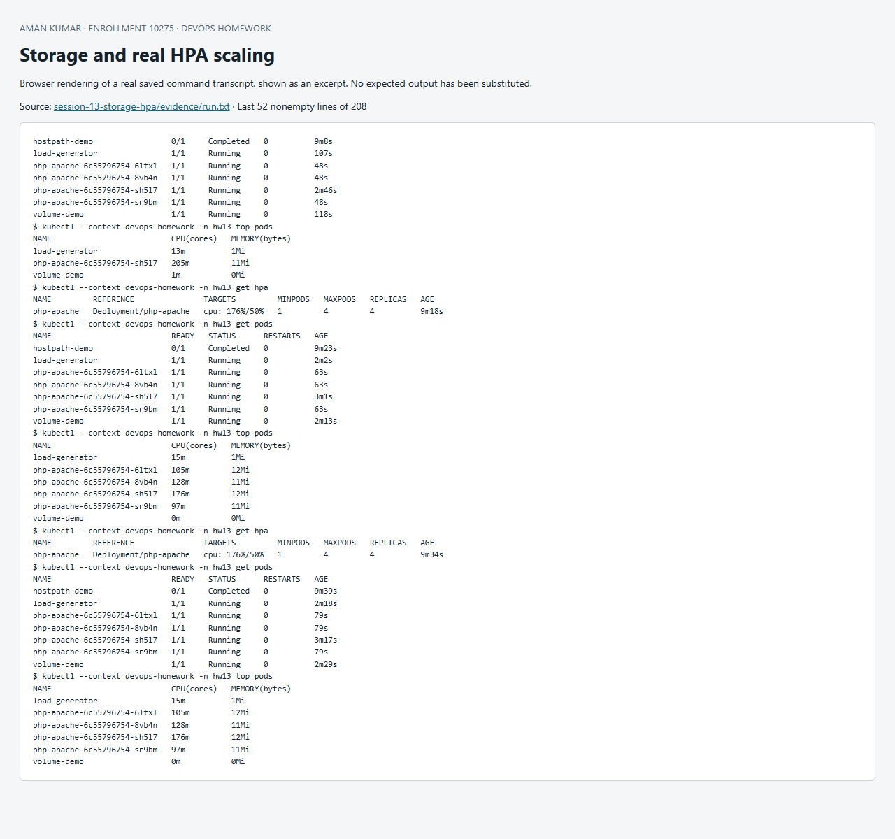

# Session 13 — Storage, autoscaling and probes

Volume concepts and exercises: [`01-kubernetes-volumes/README.md`](01-kubernetes-volumes/README.md).

## HPA hands-on

[`hpa.yml`](hpa.yml) deploys the official CPU-intensive `registry.k8s.io/hpa-example` application, a Service and an autoscaling/v2 HPA. CPU requests are 100m; the target is 50% of that request, with 1–4 replicas. Metrics Server must be available (`minikube addons enable metrics-server -p devops-homework`). CPU utilization is measured against **requests**, not CPU limits. The lab includes a 300m container limit and a short scale-down stabilization window for local demonstration.

[`load-generator.yaml`](load-generator.yaml) sends repeated HTTP requests for at most six minutes. The script records `kubectl get hpa`, `kubectl get pods`, `kubectl top pods` at 15-second intervals and `kubectl describe hpa`. It then removes the load generator and observes scale-down. Initial `<unknown>` metrics can occur before the first Metrics Server samples; they must not be misreported as successful autoscaling.

## Probes

The workload defines an HTTP startup probe and lightweight TCP readiness/liveness probes. The official PHP root path is intentionally CPU-intensive, so repeatedly probing it with HTTP would create artificial baseline CPU load and prevent scale-down. A real app should expose a cheap dedicated HTTP health endpoint. Startup allows initialization before other probes run. Readiness removes an unready endpoint from Service traffic. Liveness triggers a container restart after sustained failure. A dependency outage usually belongs in readiness rather than liveness to avoid restart loops. Probe thresholds should reflect measured application startup/response times.

## Mini project: persistent data and an autoscaled service

The assignment mentions a mini project without its specification; its linked instructor repository returned 404. This original equivalent combines: dynamic PVC provisioning, emptyDir scratch space, a persistence test across Pod replacement, a bounded hostPath demonstration, a Service-backed CPU workload, resource requests/limits, three health probes and HPA load generation. It intentionally keeps a single writer for the ReadWriteOnce PVC and keeps the stateless autoscaled application independent of that volume. RWO is a single-node access mode, not a guarantee of one writer process.

Acceptance criteria are a Bound PVC, the sentinel surviving Pod deletion, valid metrics, HPA replicas rising above one under load, and reduction after load stops. Actual results are recorded in evidence; no load/scaling claims are based solely on YAML.

References: [HPA walkthrough](https://kubernetes.io/docs/tasks/run-application/horizontal-pod-autoscale-walkthrough/), [probes](https://kubernetes.io/docs/tasks/configure-pod-container/configure-liveness-readiness-startup-probes/), [persistent volumes](https://kubernetes.io/docs/concepts/storage/persistent-volumes/).

## Reproduce and evidence

Run from this directory in PowerShell with `kubectl` on PATH and the dedicated `devops-homework` Minikube context:

```powershell
./Run-Lab.ps1
```

The script records the actual commands and output in [`evidence/run.txt`](evidence/run.txt). Expected failure commands are explicitly marked `TryK`; other failures stop the run. Resources are confined to the session namespace. Cleanup is `kubectl --context devops-homework delete namespace hw13`; persistent homework data in that namespace is deleted by cleanup. Never run cleanup against a production context.


## Screenshot of captured output

This browser screenshot renders an excerpt from the linked actual command log. Full output remains available in the evidence files above.



## Recorded result

The actual 8 October 2026 run verified a Bound 64Mi PVC, read the sentinel after replacing its Pod, and read the hostPath file. Under load, HPA CPU reached 205% of the 100m request and replicas increased from one to four. After removing load, CPU fell to 1%, the controller emitted `New size: 1; reason: All metrics below target`, and only one application Pod remained. Both scale-up and scale-down assertions passed. See [full transcript](evidence/run.txt), [compact exact excerpts](evidence/run-excerpt.txt), and [converged final state](evidence/final-state.txt).

The basic scaling calculation at the first high sample is `ceil(1 * 205 / 50) = 5`, bounded to the configured maximum of four. Real HPA decisions also account for missing metrics, readiness, tolerance and stabilization; this explains why newly created Pods and the status table can lag the desired scale. [Official HPA algorithm](https://kubernetes.io/docs/concepts/workloads/autoscaling/horizontal-pod-autoscale/).
