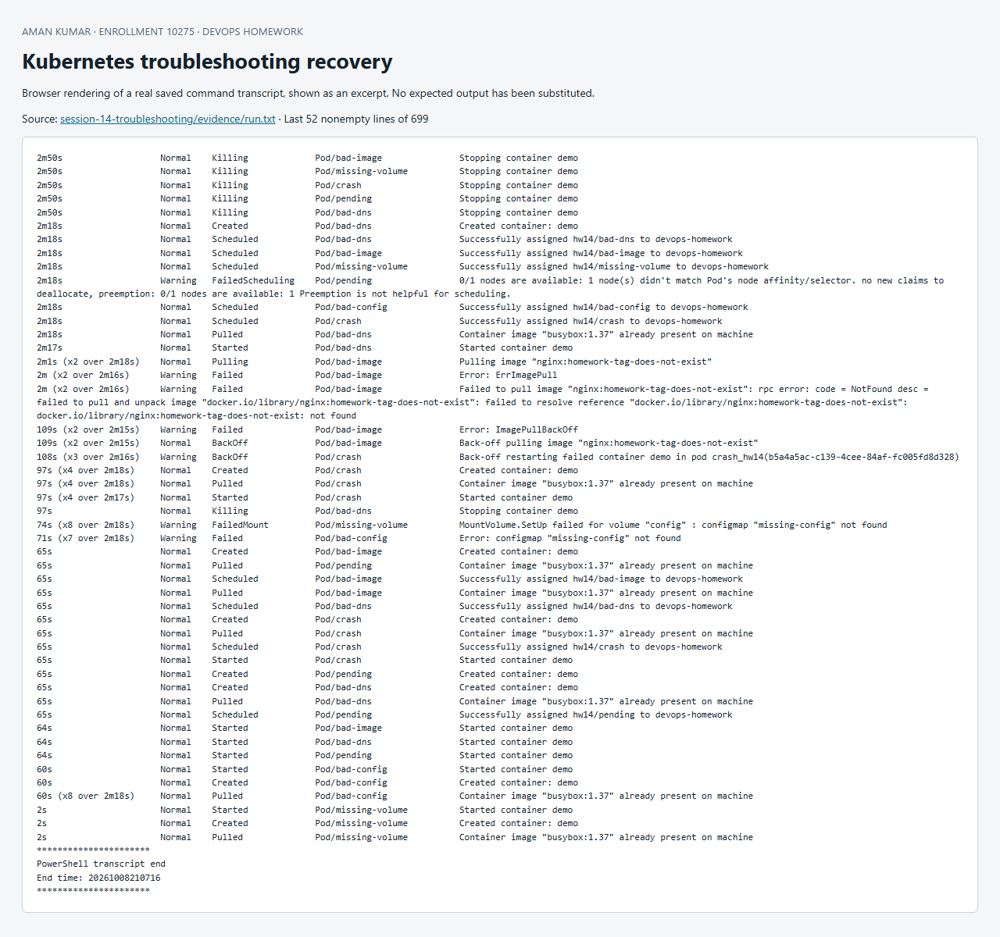

# Session 14 — Kubernetes troubleshooting

## Reproducible failure workshop / mini project

The supplied mini-project details were not accessible; the instructor repository returned 404. This original workshop intentionally introduces independent failures in namespace `hw14`, investigates evidence and fixes the actual causes. [`broken.yaml`](broken.yaml) contains the failures; [`fixed.yaml`](fixed.yaml) contains corrected resources. The script deletes only selected defective standalone lab Pods where immutable fields require recreation.

| Symptom | Investigation | Root cause | Fix and verification |
|---|---|---|---|
| CrashLoopBackOff | describe crash; logs crash --previous | Command exits 1; restartPolicy Always restarts it with backoff | Replace faulty command; logs show recovered, Pod Ready |
| ErrImagePull → ImagePullBackOff | describe bad-image and events | Nonexistent image tag | Use busybox:1.37; wait for Ready |
| Pending | describe pending scheduling events | Selector matches no node | Recreate without selector; Pod scheduled |
| ContainerCreating | describe missing-volume | Required ConfigMap volume absent, FailedMount events | Create ConfigMap; mounted container starts |
| CreateContainerConfigError | describe bad-config | Required env key source ConfigMap absent | Create APP_ENV key; printenv verifies value |
| Service timeout / no endpoint | get Service and EndpointSlices, direct Pod/local HTTP | Service selector app=typo mismatches labels | Restore app=web; Service HTTP succeeds |
| DNS lookup fails | nslookup, /etc/resolv.conf | Pod explicitly points to reserved non-cluster DNS server | Recreate using default ClusterFirst; Service FQDN resolves |
| Pod connection refused | Direct Pod-IP HTTP on ports 81 and 80 | Client used wrong destination port | Use port 80 and receive response |

ErrImagePull describes the failed pull attempt; ImagePullBackOff is the retry-backoff state. The same Pod can exhibit both over time. Pod networking is diagnosed by layer: application listener → Pod IP → Service endpoints → Service DNS → policies/CNI/node routes. This lab reproduces a wrong destination port; it does not claim to have broken or repaired the cluster CNI. A successful direct IP request with failed DNS isolates name resolution from packet reachability.

## Commands and purpose

| Command | Evidence it provides |
|---|---|
| kubectl get / get -o wide | Phase, readiness, node, Pod IP, endpoint presence |
| kubectl describe | Spec, scheduling, image/mount/probe errors, recent events |
| kubectl logs / logs --previous | Current or last terminated container output |
| kubectl exec | Environment, resolver settings and real network requests |
| kubectl events | Recent chronological controller/kubelet observations |
| kubectl explain | API field semantics and valid structure |
| kubectl top | Current measured CPU/memory; needs Metrics Server |

Troubleshooting sequence: state the failed expectation; compare desired and observed state; narrow the failure by layer; change the smallest responsible configuration; re-run the failing check; ensure all affected Pods become Ready. The full transcript preserves expected failures and successful after-checks.

References: [debug Pods](https://kubernetes.io/docs/tasks/debug/debug-application/debug-pods/), [debug Services](https://kubernetes.io/docs/tasks/debug/debug-application/debug-service/), [DNS resolution](https://kubernetes.io/docs/tasks/administer-cluster/dns-debugging-resolution/).

## Reproduce and evidence

Run from this directory in PowerShell with `kubectl` on PATH and the dedicated `devops-homework` Minikube context:

```powershell
./Run-Lab.ps1
```

The script records the actual commands and output in [`evidence/run.txt`](evidence/run.txt). Expected failure commands are explicitly marked `TryK`; other failures stop the run. Resources are confined to the session namespace. Cleanup is `kubectl --context devops-homework delete namespace hw14`; persistent homework data in that namespace is deleted by cleanup. Never run cleanup against a production context.


## Recorded result

The recorded run on 8 October 2026 captured CrashLoopBackOff, ErrImagePull / ImagePullBackOff events, Pending, ContainerCreating and CreateContainerConfigError, plus failed Service, DNS and wrong-port requests. After the fixes all seven Pods became Ready; the corrected DNS name resolved, the configuration printed homework, and both Service and direct-Pod HTTP returned v1.


## Screenshot of captured output

This browser screenshot renders an excerpt from the linked actual command log. Full output remains available in the evidence files above.


