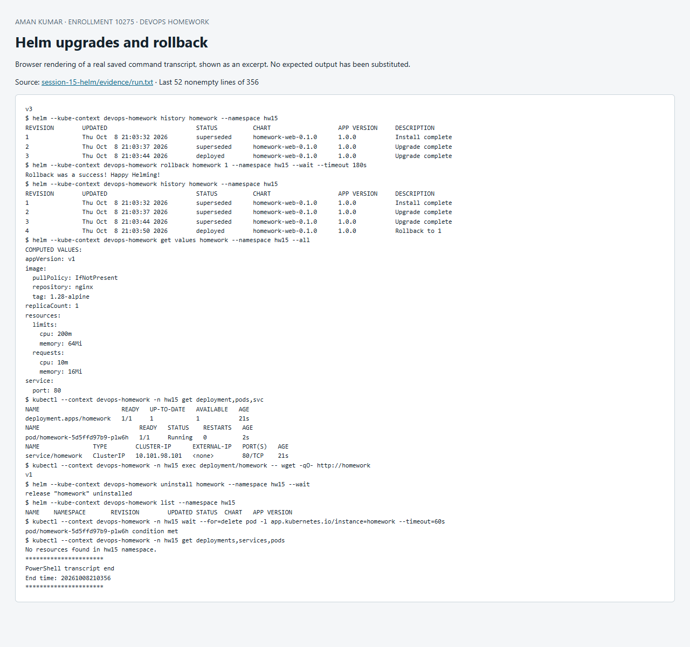

# Session 15 — Helm lifecycle and rollback

The original mini project specification was not included in the accessible assignment; the linked instructor repository returned 404. This original mini project packages a small versioned web application as a Helm chart and verifies its full release lifecycle against a live Minikube cluster.

## Chart and values

[`chart/Chart.yaml`](chart/Chart.yaml) contains chart identity/version, [`chart/values.yaml`](chart/values.yaml) supplies defaults, and [`chart/templates`](chart/templates) renders Deployment and Service resources. Chart version describes the package; appVersion metadata describes the application and is distinct from `.Values.appVersion`, which this example injects into the response. Release name scopes resource names and selectors. All resources are created in namespace hw15.

## Reproduce

```powershell
./Run-Lab.ps1 -Context devops-homework -Helm helm
# Or pass the full path to a portable helm executable.
```

The script creates a fresh scaffold in the operating-system temporary directory to demonstrate `helm create`, then installs the reviewed small chart committed here. It captures real commands and responses in [`evidence/run.txt`](evidence/run.txt), and stops if a required command fails. Run the script when the release does not already exist; its final uninstall enables a repeat run.

| Command | Purpose and verification |
|---|---|
| helm create | Generate a starter chart; scaffold is placed in a unique temporary directory |
| helm repo add/update/list | Add the official Prometheus community chart index, refresh and list it |
| helm search repo | Search available chart versions; does not install them |
| helm lint | Check chart structure/templates |
| helm template | Inspect the rendered Kubernetes YAML before installation |
| helm install --wait | Install revision 1 with v1 and one ready replica |
| helm list/status | Inspect release state and deployed revision |
| helm get all/values | Inspect saved manifest, values and notes |
| helm upgrade | Revision 2 → v2/two replicas, revision 3 → v3/two replicas |
| helm history | Show successful revisions and superseded/deployed states |
| helm rollback 1 --wait | New revision 4 uses revision 1 configuration; response returns v1 and replica count one |
| helm uninstall --wait | Remove release resources; empty namespace verification follows |

## Verified rollback workflow

Install → HTTP v1 → upgrade with [`values-v2.yaml`](values-v2.yaml) → HTTP v2 → upgrade with [`values-v3.yaml`](values-v3.yaml) → HTTP v3 → rollback to revision 1 → HTTP v1. `--wait` waits for readiness; the explicit HTTP checks verify the application version, not just the Helm status. Rollback creates a new revision rather than deleting history. Revision rollback cannot automatically reverse external database migrations or restore deleted persistent data; this stateless exercise avoids those dependencies.

Use `helm upgrade --install` for an idempotent deployment command in automation, and pin chart/image versions. Avoid secrets in committed values files: Helm stores release information in the cluster and users with suitable permissions can inspect it. The chart contains no credentials.

Reference: [Using Helm](https://helm.sh/docs/intro/using_helm/), [Helm command reference](https://helm.sh/docs/helm/).

## Recorded result

The recorded run on 8 October 2026 used Helm v3.19.0. Actual HTTP responses were `v1`, `v2`, `v3`, then `v1` after rollback. Revision 4 says `Rollback to 1`. Uninstall finished and the final resource query reported no resources in hw15.


## Screenshot of captured output

This browser screenshot renders an excerpt from the linked actual command log. Full output remains available in the evidence files above.


