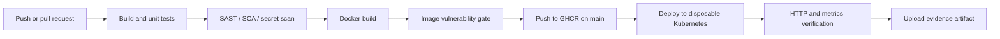

# Session 16 — CI/CD and GitHub Actions

**Aman Kumar · Enrollment 10275**

This demo uses the [final project's Node application](../final-devops-project/application), [multi-stage Dockerfile](../final-devops-project/docker/Dockerfile), and [active GitHub Actions workflow](../.github/workflows/devsecops.yml).

The brief names `10-final-cicd-pipeline` without a repository URL. This is an original implementation covering the listed outcomes; it is not presented as a clone of unavailable instructor files.

## Pipeline



**Continuous integration** validates each change with builds and tests. **Continuous delivery** keeps a verified artifact ready to deploy; **continuous deployment** automatically deploys it after gates pass. This workflow automatically deploys to an ephemeral test cluster, not to AWS or a persistent production environment.

| Concept | Implementation |
|---|---|
| Workflow | `.github/workflows/devsecops.yml`, triggered by relevant main pushes, PRs and manual dispatch |
| Job | `build-test-scan-deploy`, on an Ubuntu runner |
| Steps | Checkout, Node setup, build, tests, security scans, image build/push, Kubernetes smoke test |
| Runner | Temporary GitHub-hosted Ubuntu 24.04 VM |
| Secret | Short-lived `GITHUB_TOKEN` for GHCR, randomized Kubernetes demo token created at runtime |
| Artifact | `devops-evidence-<run number>` with unit tests, scan reports and deployment output |
| Container registry | `ghcr.io/reaperxd67/devops-homework` with immutable commit SHA and moving `latest` tag |

## Run locally

```sh
cd final-devops-project/application
npm ci --ignore-scripts
npm run build
npm test
npm start
```

The tests send real HTTP requests and check the home page, liveness/readiness, API metadata, increasing request metric, 404 handling and unique correlation IDs. Pull-request and non-main runs skip registry login and image publishing. Fork pull requests also receive GitHub's restricted token permissions.

## Execution evidence

[Workflow runs](https://github.com/ReaperXD67/devops-homework/actions/workflows/devsecops.yml) · [saved run and report evidence](evidence/README.md)

The final successful run link and screenshot are preserved in the evidence page. GitHub's downloadable artifact expires after 30 days; selected reports are also committed here so the submission remains inspectable.

Source: [GitHub Actions concepts](https://docs.github.com/en/actions/about-github-actions/understanding-github-actions).
