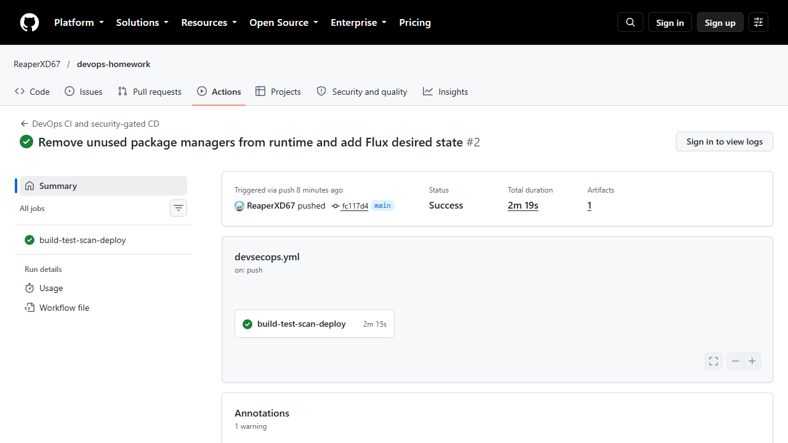

# Successful CI/CD execution

**Run:** [37801380225 — all gates and deployment succeeded](https://github.com/ReaperXD67/devops-homework/actions/runs/37801380225)  
**Source commit:** `fc117d495fbe37568d8a72f06838d61e8946af1a`  
**Date:** 8 October 2026  
**Result:** Success

[Machine-readable run metadata and step results](workflow-run.json)

## Preserved reports

- [Five passing unit tests](reports/devops-evidence-2/unit-tests.txt)
- [Semgrep SAST report](reports/devops-evidence-2/sast.json)
- [npm dependency audit](reports/devops-evidence-2/sca.json)
- [Trivy secret scan](reports/devops-evidence-2/secrets.json)
- [Trivy image vulnerability scan](reports/devops-evidence-2/image-scan.json)
- [Kubernetes deployment state](reports/devops-evidence-2/kubernetes.txt)
- [API response from deployed application](reports/devops-evidence-2/deployed-api.json)
- [Metrics from deployed application](reports/devops-evidence-2/deployed-metrics.txt)
- [Application JSON logs](reports/devops-evidence-2/application-logs.txt)

The run published `ghcr.io/reaperxd67/devops-homework:fc117d495fbe37568d8a72f06838d61e8946af1a` and `:latest`. The image was subsequently pulled locally; anonymous access to GHCR's pull-token endpoint also succeeded. The deployed application returned enrollment 10275. The disposable kind cluster verifies the Deployment and Service; its HPA has no Metrics Server, so resource metrics there are unknown. Actual HPA scaling is demonstrated with Metrics Server in [Session 13](../../session-13-storage-hpa/README.md).

## Earlier failed run and remediation

[Run 37800876628](https://github.com/ReaperXD67/devops-homework/actions/runs/37800876628) passed the application checks but was blocked by vulnerable npm/Yarn packages inherited from the Node base image. No image was published by that failed run. Removing these unused package managers from the runtime filesystem fixed the findings without disabling the gate. The corrected image passed the same HIGH/CRITICAL threshold.

These reports describe the source commit above. Later documentation-only commits do not rerun this workflow; application, Docker, manifest or workflow changes trigger fresh checks.
