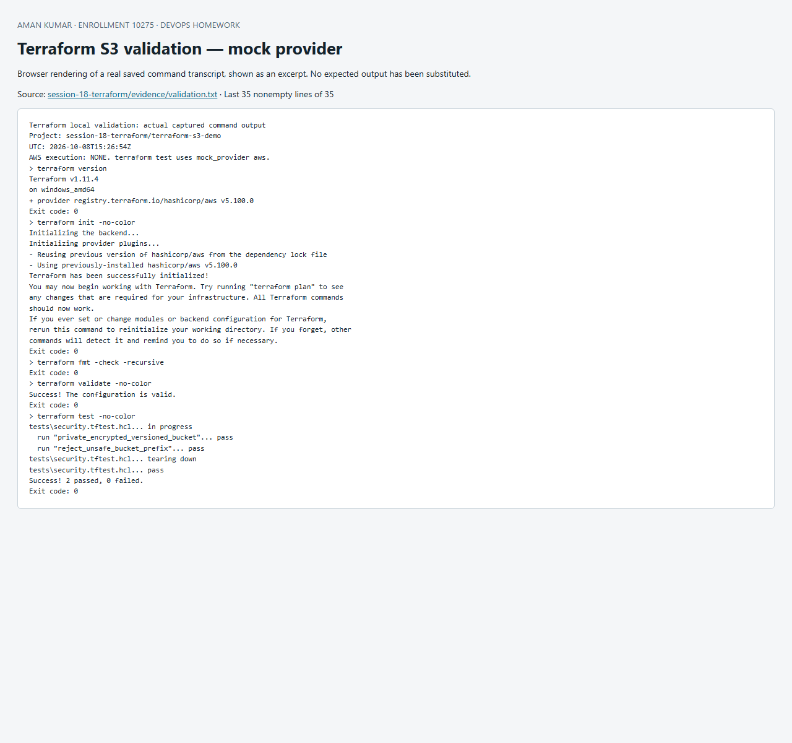

# Session 18 — Terraform & Infrastructure as Code

**Aman Kumar · Enrollment 10275**

The S3 implementation and AWS research are complete. Local Terraform initialization, formatting, schema validation and mock-provider tests are recorded in [validation evidence](evidence/validation.txt). **Live AWS plan/apply/show/output/destroy is pending AWS account setup.** Mock tests create no cloud resources and do not prove that AWS accepted a deployment.

| Assignment deliverable | Submission |
| --- | --- |
| S3 Terraform project and full workflow | [terraform-s3-demo/README.md](terraform-s3-demo/README.md) |
| IAM governance | [01-iam/README.md](aws-services/01-iam/README.md) |
| EC2 compute | [02-ec2/README.md](aws-services/02-ec2/README.md) |
| S3 storage | [03-s3/README.md](aws-services/03-s3/README.md) |
| VPC networking | [04-vpc/README.md](aws-services/04-vpc/README.md) |
| DynamoDB and RDS | [05-dynamodb-rds/README.md](aws-services/05-dynamodb-rds/README.md) |
| AWS account/CLI setup before live execution | [AWS-SETUP.md](AWS-SETUP.md) |

Infrastructure as Code stores the intended infrastructure in reviewable text. Terraform compares configuration, state and provider observations, builds a dependency graph, proposes a plan and applies the selected changes. The provider lock file pins the dependency selected during initialization; state tracks managed resource identities and belongs outside Git.

The examples use a deliberately pinned AWS provider 5.100.x and Terraform >=1.7; validation evidence records the exact installed versions. These are reproducible lab versions, not a claim to use the newest releases.

To reproduce the local checks from the repository root with Terraform installed:

```powershell
./session-18-terraform/verify-terraform.ps1
```

This checks the S3 project, cloud root, reusable cloud module and final-project Terraform root without AWS credentials. The script stops at the first failing command. [HashiCorp explains that mocked providers return generated attributes rather than creating infrastructure.](https://developer.hashicorp.com/terraform/language/tests/mocking)


## Screenshot of captured output

This browser screenshot renders an excerpt from the linked actual command log. Full output remains available in the evidence files above.


