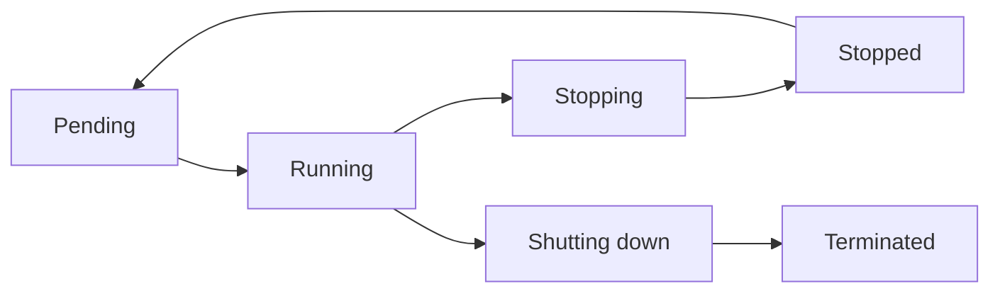

# EC2 — compute

**Aman Kumar · Enrollment 10275**

Amazon EC2 provides virtual machines called instances. The learner manages the operating system and applications, while AWS provides the underlying compute infrastructure.

| Concept | Explanation |
| --- | --- |
| AMI | Boot image containing an operating system/software and block-device mapping; must match Region and CPU architecture |
| Instance type | CPU, memory and networking capacity; this lab chooses x86_64 `t3.micro` |
| Key pair | Public/private keys for SSH authentication; protect the private key |
| Security group | Stateful network allow rules associated with the instance's network interface |
| EBS | Persistent block storage; encrypted `gp3` is used for this lab's root disk |
| Private IP | Address used inside the VPC/routed private networks |
| Public IP | Internet-routable address requiring suitable routes and firewall rules |

The module reads the current Amazon Linux 2023 x86_64 AMI from the AWS public SSM parameter. That avoids hardcoding a Region-specific AMI. [AWS AMI documentation](https://docs.aws.amazon.com/en_en/AWSEC2/latest/UserGuide/AMIs.html).

## Lifecycle



Stopping an EBS-backed instance retains EBS data and its private address; an automatically assigned public IPv4 can change after start. Termination is permanent, and volumes with delete-on-termination enabled are removed. Stopping compute does not eliminate storage-related charges. [AWS instance lifecycle](https://docs.aws.amazon.com/AWSEC2/latest/UserGuide/ec2-instance-lifecycle.html).

## Lab application

Common uses include web servers, build workers, batch processing and self-managed services. [Session 19](../../../session-19-cloud/README.md) declares an Nginx host with encrypted EBS, mandatory IMDSv2 and HTTP access restricted to one learner address. Administrative access uses Systems Manager rather than an exposed SSH port or committed key. [AWS describes Session Manager as an alternative to key pairs.](https://docs.aws.amazon.com/AWSEC2/latest/UserGuide/ec2-key-pairs.html)

Pending live verification commands:

```powershell
aws ec2 describe-instances --filters Name=tag:Name,Values=aman-scaler-s19-web
aws ec2 describe-instance-status --include-all-instances
aws ssm describe-instance-information
```

These commands are a runbook, not captured cloud results.
