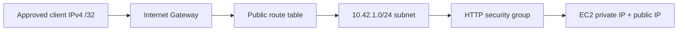

# VPC — networking

**Aman Kumar · Enrollment 10275**

A Virtual Private Cloud defines an isolated AWS network. CIDR notation combines an address with a prefix length: `10.42.0.0/16` contains the smaller `10.42.1.0/24` subnet used here. Each subnet belongs to one Availability Zone.

| Component | Role |
| --- | --- |
| Subnet | A portion of VPC address space in one Availability Zone |
| Route table | Chooses a destination's next hop using route matches |
| Internet Gateway | VPC attachment supporting internet connectivity for appropriately addressed resources |
| NAT Gateway | Lets private IPv4 workloads initiate outbound traffic without direct inbound internet access |
| Public subnet | Has a direct route to an Internet Gateway |
| Private subnet | Has no direct Internet Gateway route; may use NAT for outbound access |

Public subnet membership alone does not make an EC2 instance internet-reachable: it also needs appropriate addressing and permitted traffic. [AWS subnet and routing documentation](https://docs.aws.amazon.com/vpc/latest/userguide/configure-subnets.html).

| Security control | Security group | Network ACL |
| --- | --- | --- |
| Scope | Associated resource/network interface | Subnet boundary |
| Rules | Allow | Allow and deny, evaluated in order |
| Connection behavior | Stateful; response traffic is allowed | Stateless; both directions need suitable rules |

Use narrow security-group sources and ports. The lab uses TCP 80 only from one `/32`; no inbound SSH or Kubernetes API is opened. Its outbound TCP 80/443 rules support package downloads and SSM. Amazon-provided DNS is not filtered by security groups. [AWS security group documentation](https://docs.aws.amazon.com/vpc/latest/userguide/vpc-security-groups.html), [AWS VPC security](https://docs.aws.amazon.com/vpc/latest/userguide/VPC_Security.html).

## Lab path

[Session 19 source](../../../session-19-cloud/modules/infrastructure/main.tf) builds the whole path. No NAT Gateway is created for this single public-subnet lab. A production design commonly uses multiple AZs, private application subnets and a controlled entry point; this learning architecture makes no high-availability claim.
