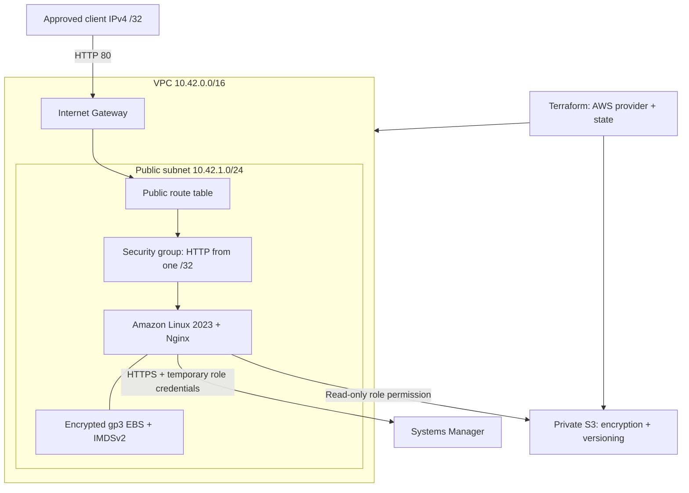
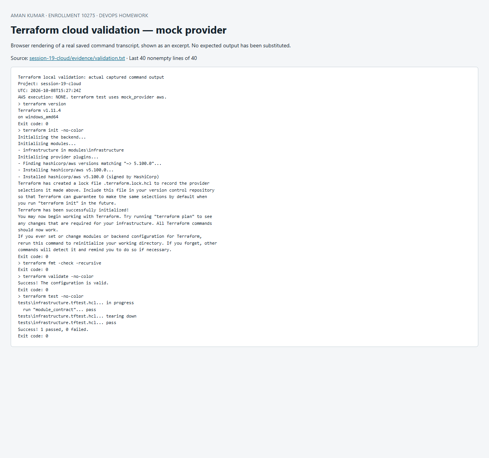

# Session 19 — Cloud & Terraform in Action

**Aman Kumar · Enrollment 10275**

This project defines a complete learning network and Nginx host: VPC, subnet, Internet Gateway, routes, security group, EC2, instance role and private S3 artifact bucket. **Implementation and local checks are complete; live AWS provisioning is pending account setup.**

Actual evidence: [root validation/mock tests](evidence/validation.txt) and [module security tests](evidence/module-validation.txt). Mocked AMI/instance IDs, names and IP addresses exist only in test data and are not real cloud resources. AWS screenshots will be added after live execution.

## Architecture



The subnet has a direct default route to the Internet Gateway. EC2 explicitly requests a public IP; the subnet does not automatically assign one to every future resource. No NAT Gateway, database, EKS cluster or load balancer is created. HTTP serves only a lab page; it is not an authenticated production endpoint.

## Terraform design

| Concept | Implementation |
| --- | --- |
| Provider | Pinned `hashicorp/aws` 5.100.x; Region and common tags in `provider.tf` |
| Variables | Region, project name, instance type and allowed client `/32` |
| Resources | Declarative VPC/network, EC2, IAM and S3 resources in `modules/infrastructure` |
| Data sources | Available AZs and public SSM parameter for the Amazon Linux 2023 x86_64 AMI |
| Outputs | VPC, subnet, EC2 ID, website URL and bucket name |
| Dependencies | Attribute references connect resources; explicit bootstrap dependencies wait for route association, SSM policy and egress rules |
| Reuse | The final project invokes the same module under a separate root and state |
| State | Local state tracks created IDs; it is ignored by Git and must be preserved securely until cleanup |

The instance requires IMDSv2 and encrypted EBS. The role allows Systems Manager and read-only access to its own bucket. The bucket has versioning, SSE-S3 encryption, ACLs disabled, all public access blocked and a TLS-only policy. `force_destroy=false` protects a non-empty bucket. No SSH key or AWS credential is embedded.

## Local validation

```powershell
cd session-19-cloud
terraform init
terraform fmt -check -recursive
terraform validate
terraform test
terraform -chdir=modules/infrastructure init
terraform -chdir=modules/infrastructure test
```

Root tests verify output wiring. Module tests verify network attachments, the restricted inbound rule, IMDSv2, encrypted EBS, private/versioned S3 and rejection of `0.0.0.0/0` or an incompatible ARM instance type. All tests use a mocked provider, so they check Terraform logic rather than AWS API authorization, image availability or network reachability. [HashiCorp provider mocking](https://developer.hashicorp.com/terraform/language/tests/mocking).

## Live deployment (pending)

Complete [AWS setup](../session-18-terraform/AWS-SETUP.md). From this directory create ignored `local.auto.tfvars` containing your real public IPv4 `/32`:

```hcl
allowed_http_cidr = "YOUR_PUBLIC_IPV4/32"
```

The placeholder above must be replaced with a valid address; the checked-in default is a documentation address. Then execute:

```powershell
$env:AWS_PROFILE = 'scaler-lab'
aws sso login --profile scaler-lab
aws sts get-caller-identity
terraform init
terraform fmt -recursive
terraform validate
terraform plan -out=lab.tfplan
terraform show lab.tfplan
terraform apply lab.tfplan
terraform show
terraform output
$instanceId = terraform output -raw instance_id
$websiteUrl = terraform output -raw website_url
aws ec2 wait instance-status-ok --instance-ids $instanceId
# Allow cloud-init to finish installing Nginx, then verify from the permitted IP.
Invoke-WebRequest "$websiteUrl/health"
Invoke-WebRequest $websiteUrl
aws ssm describe-instance-information
terraform plan
```

The intended HTTP body is `Hello World from Terraform on AWS`; `/health` should return `ok`. These values come from [user-data.sh](modules/infrastructure/user-data.sh) and are acceptance criteria, not evidence of a completed apply. EC2 status checks can pass before cloud-init finishes.

For administrative access, install the official [Session Manager plugin](https://docs.aws.amazon.com/systems-manager/latest/userguide/session-manager-working-with-install-plugin.html), then:

```powershell
aws ssm start-session --target $instanceId
```

Inside the host inspect `sudo cloud-init status --wait`, `sudo journalctl -u nginx` and `curl http://localhost/health`. Use those checks to separate bootstrap failure from routing or client-IP issues.

## Evidence and cleanup

After deployment record the plan/apply, `terraform output`, HTTP response, EC2/S3 console views and final cleanup in `evidence/aws-live.txt` and `evidence/`. Redact sensitive identifiers before public publication. Do not publish state or binary plans.

```powershell
# Leave the artifact bucket empty during this lab.
terraform plan -destroy -out=destroy.tfplan
terraform show destroy.tfplan
terraform apply destroy.tfplan
terraform state list
# Equivalent interactive cleanup command: terraform destroy
```

Empty state after successful destroy is the cleanup check. S3 object versions or objects must be deliberately removed before a non-empty bucket can be destroyed. Keep each root's state separate; Session 19 and the final wrapper are separate environments.

EC2, storage and public IPv4 can be billable. This one-AZ lab is intentionally small, with no high-availability claim. Cloud Kubernetes installation and final-application deployment remain separate work after AWS access is ready.


## Screenshot of captured output

This browser screenshot renders an excerpt from the linked actual command log. Full output remains available in the evidence files above.


