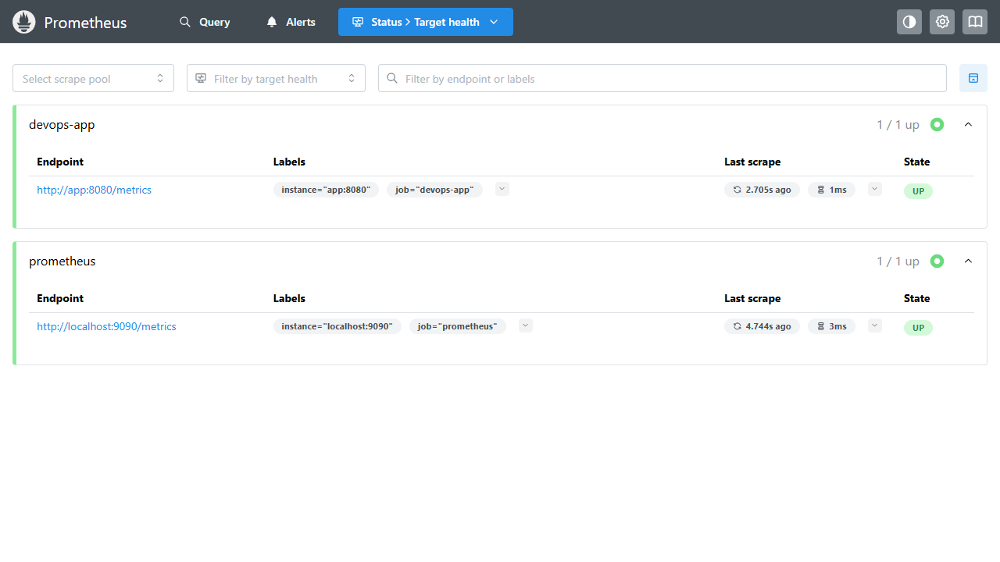
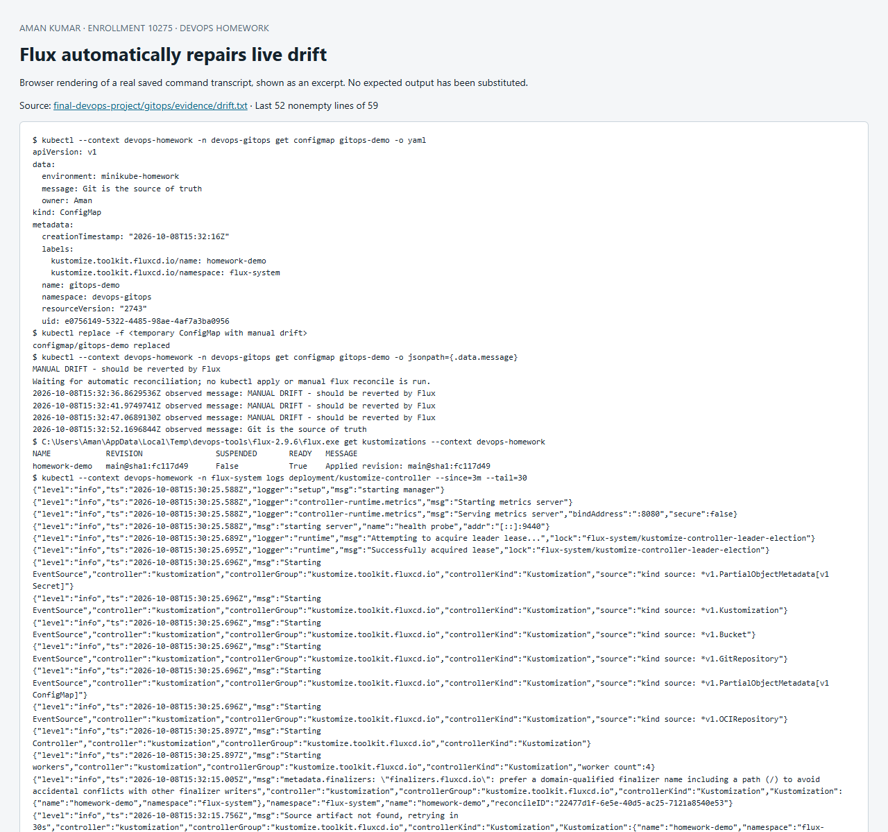

# Session 20 — Monitoring, observability and GitOps

**Aman Kumar · Enrollment 10275**

## Monitoring demo

The [runnable monitoring stack](../final-devops-project/monitoring) uses the final Node.js application and Prometheus. Start it with:

```sh
docker compose -f final-devops-project/monitoring/compose.yaml up -d --build
curl http://localhost:8200/healthz
curl http://localhost:8200/metrics
# Prometheus UI: http://localhost:9090
```

| Requirement | Implemented evidence |
|---|---|
| Metrics | `/metrics` exposes request count, CPU time, RSS memory and uptime |
| Logs | JSON log entries include timestamp, path, status and request correlation ID |
| Alerts | `ApplicationDown` fires when the app scrape fails for 10 seconds; memory alert threshold is 100 MiB |
| CPU utilization | `rate(process_cpu_seconds_total{job="devops-app"}[1m])` is CPU cores used; multiply by 100 for percent of one core |
| Memory utilization | `process_resident_memory_bytes{job="devops-app"}` is actual resident memory, not a percentage |
| Health | `/healthz`, `/readyz`, Prometheus target `up`, Docker healthcheck and Kubernetes probes |

The [verification script](../final-devops-project/monitoring/verify.ps1) deliberately stopped the app. Prometheus recorded the `ApplicationDown` alert as **firing**. Restarting the app restored the target and the alert list became empty. See the [complete actual transcript](../final-devops-project/monitoring/evidence/run.txt) and [metrics/log state](../final-devops-project/monitoring/evidence/state.txt).

Alert evaluation is demonstrated locally. Alertmanager/email/pager delivery is not configured and no notification to another person was sent.

## The three pillars

**Metrics** are numerical time series: request rate, errors, duration, CPU and memory. They are efficient for trends and alerts but usually lack individual-request detail. Prometheus collects metrics; Grafana is commonly used for dashboards.

**Logs** are timestamped events used to explain failures and transitions. Structured JSON makes fields searchable. This demo records request path and status without request bodies, tokens or query strings. Common log systems include Loki and OpenSearch.

**Traces** follow one request through multiple services using trace/span relationships and timing. OpenTelemetry can instrument applications and send spans to a collector and backends such as Jaeger or Tempo. This single-service demo includes a correlation ID in logs/responses; that is useful for matching events but is **not a complete distributed tracing implementation**.

Observability lets an operator ask why a system behaves unexpectedly, rather than merely checking known thresholds. In Kubernetes, inspect workload logs, events, readiness, restarts, resource usage and controller state together. Metrics Server provides resource metrics for `kubectl top`/HPA; it is not a replacement for a monitoring database such as Prometheus.

## GitOps demo

[GitOps README](gitops/README.md) · [Flux manifests and actual evidence](../final-devops-project/gitops/README.md)

Flux continuously pulls this public Git repository and applies its declarative desired state. The live ConfigMap was manually changed; Flux automatically restored the value from Git at the next reconciliation. This demonstrates Git as the source of truth and self-healing, with the commit revision and timestamps preserved in the logs.

The four principles are declarative desired state, versioned/immutable history, automatic pulling, and continuous reconciliation. A Git review changes desired state; controllers reconcile it to the cluster. CI tests/builds artifacts while GitOps controllers handle desired-state delivery. Secrets should be supplied through a secret manager or encrypted workflow, never plaintext Git.

## Screenshots





Sources: [Prometheus alerting rules](https://prometheus.io/docs/prometheus/latest/configuration/alerting_rules/), [OpenTelemetry signals](https://opentelemetry.io/docs/concepts/signals/), [Flux reconciliation](https://fluxcd.io/flux/concepts/), [OpenGitOps principles](https://opengitops.dev/).
